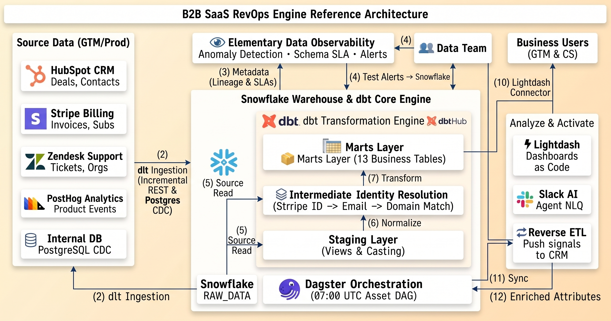
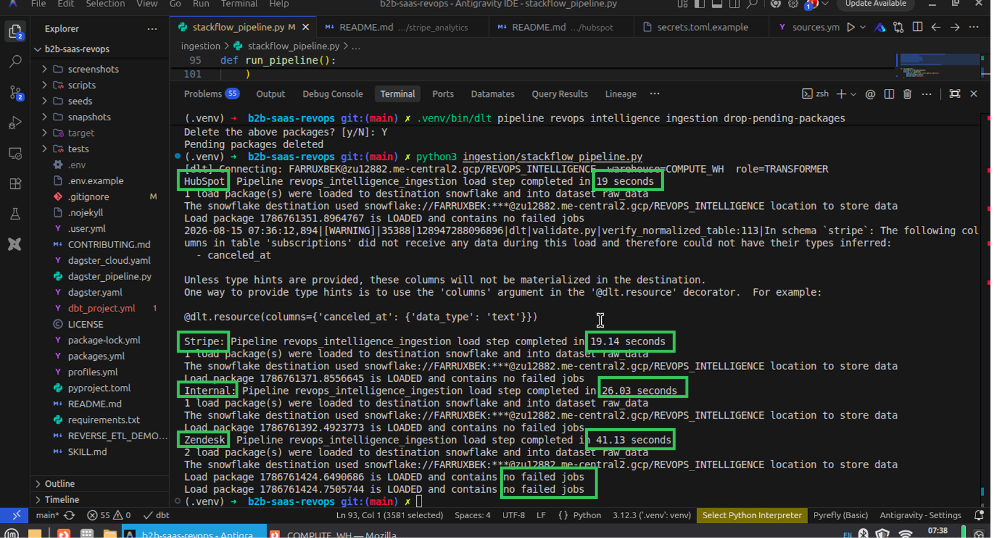
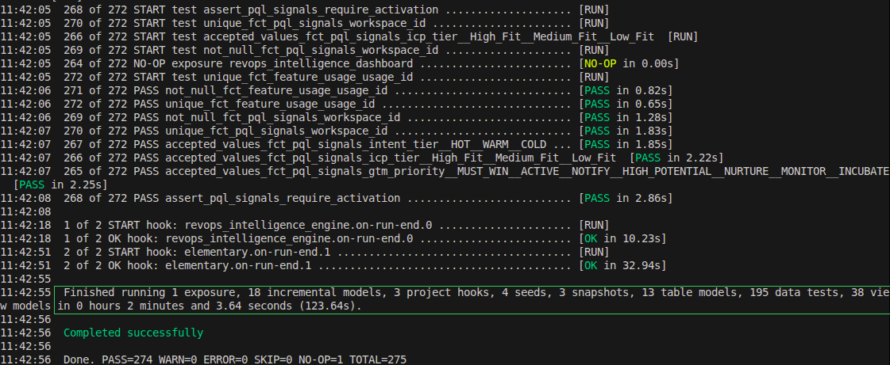
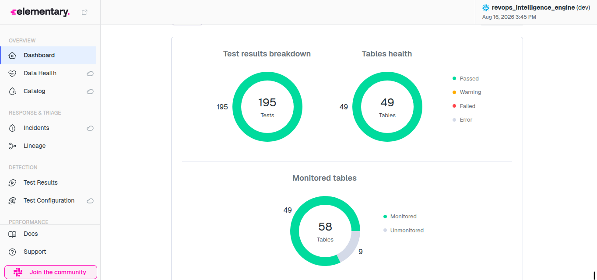
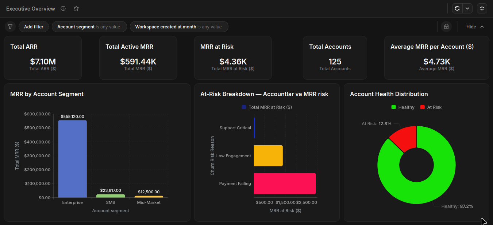
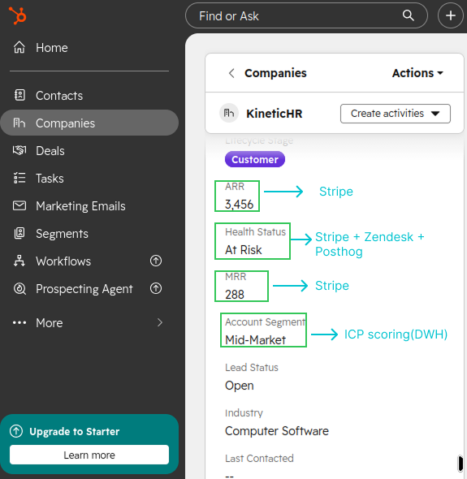
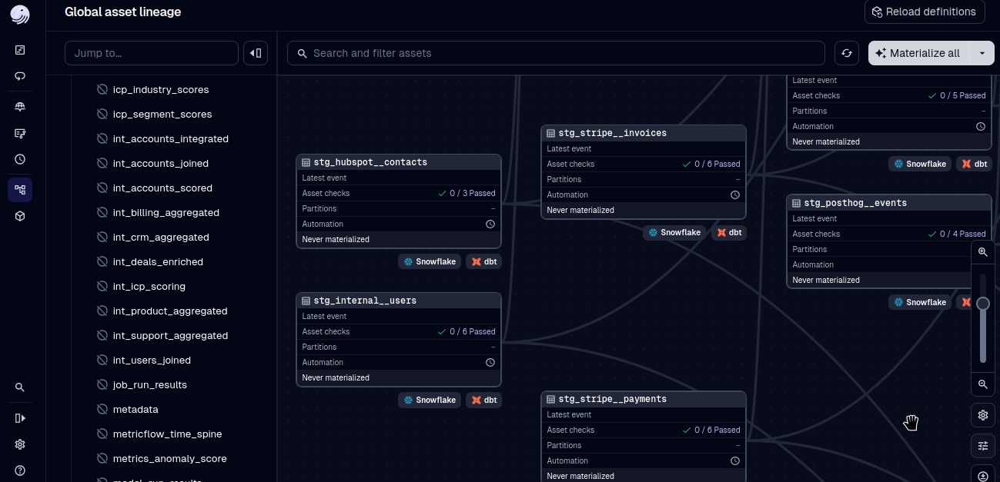
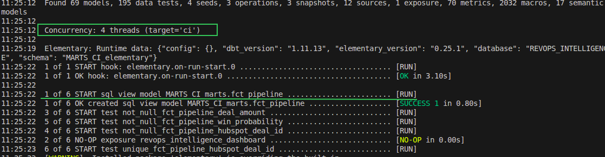

# B2B SaaS RevOps Intelligence Engine

> **[🌐 Live Portal](https://farrux05-ai.github.io/b2b-saas-revops-intelligence/)** · **[📚 dbt Docs](https://farrux05-ai.github.io/b2b-saas-revops-intelligence/dbt_docs/)** · **[🛡️ Observability Report](https://farrux05-ai.github.io/b2b-saas-revops-intelligence/elementary_report.html)**


---

## What This Is

A production-grade **Revenue Operations data pipeline** that unifies CRM, billing, support, and product data into a single source of truth — then delivers actionable insights back to GTM teams automatically.

| | |
|:-|:-|
| **Problem** | 4 disconnected tools (HubSpot · Stripe · Zendesk · PostHog) — no shared identity, silent churn, unreliable MRR |
| **Solution** | End-to-end pipeline: ingestion → transformation → semantic layer → Slack AI agent → Reverse ETL to CRM |
| **Outcome** | First run surfaced **23 at-risk accounts ($87K ARR)**. CS saved **$45K ARR in 30 days** |
| **Stack** | dlt · dbt · Snowflake · Dagster · Lightdash · Elementary · Slack Bot |
| **Infra cost** | $0/month — Snowflake free tier + open-source tooling |

---

## Business Context

**[StackFlow AI](https://stackflow.ai)** — B2B SaaS Engineering Management Platform. $3M ARR, $10M Series A, 60+ employees. Hyper-growth exposed a structural gap: each team ran best-in-class tools that never communicated.

| Team | Blind Spot |
|:-----|:-----------|
| Sales (HubSpot) | Couldn't see if won deals ever activated in the product |
| Finance (Stripe) | No visibility into which campaign/rep drove each subscription |
| Customer Success (Zendesk) | Didn't know product engagement levels of at-risk accounts |
| Product (PostHog) | Couldn't quantify the ARR risk behind low-engagement accounts |

**Real losses:**
- **Silent churn** — A $12K/yr Enterprise account cancelled after 3 weeks past-due on Stripe, 6 weeks zero Git activity, and 4 open critical tickets. Every team saw one signal. Nobody saw all three.
- **Missed expansion** — 30% of accounts had >80% seat utilization. Sales was cold-prospecting instead.
- **Inaccurate MRR** — Finance built the board report manually: 16 hrs/month, always 2–3 weeks stale, ±8% off.
- **Analyst bottleneck** — A simple segmentation question took 3 days. The data existed — across 4 systems.

---

## Architecture

```
HubSpot · Stripe · Zendesk · PostHog · Internal DB
            ↓  (dlt — incremental, schema-inferred)
         Snowflake RAW_DATA
            ↓  (dbt — 3-layer medallion)
    STAGING → INTERMEDIATE → MARTS
            ↓                      ↓
    Lightdash + Slack AI      Reverse ETL → HubSpot
            ↓
       Dagster (daily 07:00 UTC orchestration)
```



<details>
<summary><strong>Full Tech Stack</strong></summary>

| Layer | Tool | Role |
|:------|:-----|:-----|
| Ingestion | dlt | 5 live connectors → Snowflake; incremental, schema-inferred |
| Transformation | dbt | DAG-based SQL with tests, docs, and lineage |
| Warehouse | Snowflake | Cloud data warehouse |
| Observability | Elementary | Anomaly detection + Slack alerting |
| Semantic Layer | Lightdash | Metrics-as-code from dbt `meta` YAML |
| AI Q&A | Lightdash AI + Slack Bot | Natural language → Snowflake; no SQL needed |
| Orchestration | Dagster | Asset-based DAG — tracks data freshness, not script runs |
| Reverse ETL | Python + dlt | Pushes insights back to HubSpot |
| CI/CD | GitHub Actions | Slim CI, Elementary checks, auto-deploy dbt docs |

</details>

---

## 1. Ingestion (EL)

**dlt** ingests 5 sources into Snowflake `RAW_DATA` with automatic schema inference, incremental loading, and pagination.

| Source | Method | Key Tables |
|:-------|:-------|:-----------|
| HubSpot CRM | REST API + Property History | `companies`, `contacts`, `deals` |
| Stripe Billing | REST API (cursor-based) | `subscriptions`, `invoices`, `customers` |
| Zendesk Support | REST API (incremental) | `tickets`, `users`, `organizations` |
| PostHog Events | REST API | `events`, `persons` |
| Internal DB | PostgreSQL CDC (logical replication) | `users`, `workspaces`, `seats` |

**Dev mode:** `ingestion/stackflow_pipeline.py` — mock data → `DEV_RAW_DATA`  
**Prod mode:** [`b2b_dlt/`](b2b_dlt/) — live API connectors → `RAW_DATA`



---

## 2. Transformation (dbt)

3-layer medallion architecture on Snowflake:

```
RAW_DATA  →  STAGING (views: cast, rename, dedupe)
          →  INTERMEDIATE (identity stitch, domain aggregation)
          →  MARTS (tables: consumed by BI, Slack, Reverse ETL)
```



### Data Models (13 marts)

| Model | Grain | Business Question Answered |
|:------|:------|:--------------------------|
| `dim_accounts` | 1 row/account | MRR, ARR, health status, ICP tier, upsell readiness |
| `fct_accounts_health` | 1 row/account | 3-signal churn risk: payment · engagement · support |
| `fct_mrr_waterfall` | account/month | New / Expansion / Contraction / Churn / Resurrection |
| `fct_arr_movements` | account/month | ARR start, end, and change type |
| `fct_pql_signals` | 1 row/workspace | HOT / WARM / COLD intent scoring + recommended GTM action |
| `fct_pipeline` | 1 row/deal | Deal stage, win probability, days-to-close |
| `fct_subscriptions` | 1 row/subscription | Seat utilization, upsell candidacy |
| `fct_product_activation` | 1 row/account | Activation milestones, activation rate |
| `fct_retention_cohorts` | 1 row/cohort-month | NRR, GRR, Logo Churn |
| `fct_trial_conversion` | 1 row/trial | Conversion status, time-to-convert, expiry risk |
| `fct_unit_economics` | 1 row/segment | LTV, LTV:ARR ratio |
| `dim_users` | 1 row/user | Stitched identity across all systems |
| `dim_dates` | 1 row/day | Date spine for time-series joins |

<details>
<summary><strong>Key Business Logic</strong></summary>

**Health Score — 3-Signal Risk Model** (`fct_accounts_health`)

Any 2+ signals → `At Risk`:
```sql
is_payment_failing = (subscription_status = 'past_due')
is_churning_soon   = (cancel_at_period_end = true)
is_low_engagement  = (DATEDIFF('day', last_activity_at, CURRENT_DATE) > 30)

health_status = CASE
    WHEN subscription_status = 'canceled'                                THEN 'Churned'
    WHEN (is_payment_failing + is_churning_soon + is_low_engagement) >= 2 THEN 'At Risk'
    ELSE 'Healthy'
END
```

**MRR Waterfall Movement Types** (`fct_mrr_waterfall`)

| Type | Definition |
|:-----|:-----------|
| `new` | First subscription this month |
| `expansion` | MRR increased vs. prior month |
| `contraction` | MRR decreased (not $0) |
| `churn` | MRR → $0 (canceled) |
| `resurrection` | MRR returned after $0 |

**Identity Resolution** (`int_users_joined`) — hierarchical fallback:
```sql
match_method = CASE
  WHEN u.stripe_customer_id  IS NOT NULL THEN 'direct_id'
  WHEN h.hubspot_contact_id  IS NOT NULL THEN 'email_match'
  WHEN c.hubspot_company_id  IS NOT NULL THEN 'domain_l2a'
  ELSE 'unresolved'
END
```

</details>

---

## 3. Data Quality & Observability

**160 dbt tests** run on every `dbt build`. **Elementary** monitors anomalies between runs and posts failures to Slack.

> 🛡️ **[Live Observability Report](https://farrux05-ai.github.io/b2b-saas-revops-intelligence/elementary_report.html)**

| Layer | Count | Types |
|:------|:------|:------|
| Schema tests | ~130 | `unique`, `not_null`, `accepted_values` |
| Relationship tests | ~15 | FK integrity across marts |
| Custom SQL assertions | ~15 | Business logic correctness |

**Source Freshness SLAs:**

| Source | Warn After | Error After |
|:-------|:-----------|:------------|
| PostHog Events | 2 hours | 6 hours |
| HubSpot | 6 hours | 24 hours |
| Stripe | 12 hours | 48 hours |
| Zendesk | 24 hours | 48 hours |



---

## 4. Semantic Layer & Slack AI Agent

Business questions answered in plain English — no SQL, no BI login, no analyst delay.

```
"How many at-risk accounts this week?"
  → Slack Bot → Lightdash → Snowflake
  → "14 accounts — $63K MRR at risk 📊"
```

Metrics defined once in dbt YAML → served by Lightdash → consumed by Slack AI bot.


**Metric domains:** Core (MRR/ARR) · CS (health, upsell) · Finance (waterfall, NRR/GRR) · Sales (pipeline) · Product (PQL, activation) · Marketing (funnel, attribution)

---

## 5. BI Dashboards (Dashboards-as-Code)

Lightdash connects directly to Snowflake via the dbt semantic layer. All dashboards are version-controlled YAML.

| Dashboard | Audience | Key Metrics |
|:----------|:---------|:------------|
| Executive Overview | CEO / C-Suite | Total MRR, MRR at Risk, Account Health |
| Finance Revenue Analytics | CFO / Finance | MRR Waterfall, NRR vs GRR, ARR Movements |
| CS Account Health | Customer Success | At-risk list, Churn Reasons, Save Plays |
| Sales Pipeline | Sales Leaders / AEs | Deal Funnel, Weighted Pipeline, Stale Deals |
| Product PLG Signals | Product / Growth | Activation Funnel, PQL Matrix, Trial Risk |



---

## 6. Reverse ETL

Computed insights pushed **back into HubSpot** so GTM teams act without leaving their CRM.

| Signal | HubSpot Property | GTM Action |
|:-------|:----------------|:-----------|
| `fct_pql_signals.intent_tier` | `pql_intent_tier` | Sales outreach sequence |
| `fct_accounts_health.health_status` | `health_status` | CS save play trigger |
| `dim_accounts.is_ready_for_upsell` | `is_upsell_candidate` | Expansion workflow |
| `dim_accounts.arr` | `current_arr` | Deal context for Finance & Sales |

```
Snowflake → scripts/reverse_etl_dlt.py → HubSpot Companies & Contacts API
```



> **Constraint:** Only accounts with a resolved identity (`match_method != 'unresolved'`) receive Reverse ETL enrichment.

→ **[Full Reverse ETL Demo](REVERSE_ETL_DEMO.md)**

---

## 7. Orchestration

Dagster runs the full pipeline daily at **07:00 UTC** as an asset-based DAG — tracking data freshness, not just script execution.

```
07:00 UTC
  Step 1: Ingest    — dlt → Snowflake RAW_DATA
  Step 2: Transform — dbt build + Elementary tests
  Step 3: Activate  — Reverse ETL → HubSpot
```

```bash
dagster dev -f dagster_pipeline.py   # → http://localhost:3000
```



---

## 8. CI/CD

Every PR triggers automated quality gates via GitHub Actions.

| Workflow | Trigger | Action |
|:---------|:--------|:-------|
| `dbt_slim_ci.yml` | PR open/update | Build only changed + downstream models on Snowflake |
| `elementary_checks.yml` | PR open/update | Data quality checks → post results as PR comment |
| `dbt_docs_deploy.yml` | Merge to `main` | Generate + deploy dbt docs to GitHub Pages |



> Every merge auto-deploys to **[farrux05-ai.github.io/b2b-saas-revops-intelligence](https://farrux05-ai.github.io/b2b-saas-revops-intelligence/)**

---

## Quick Start

```bash
git clone https://github.com/farrux05-ai/b2b-saas-revops-intelligence.git
cd b2b-saas-revops-intelligence
uv venv .venv && source .venv/bin/activate
uv pip install -r requirements.txt

cp .env.example .env
# Configure: SNOWFLAKE_ACCOUNT, SNOWFLAKE_USER, SNOWFLAKE_PASSWORD,
#            HUBSPOT_ACCESS_TOKEN, SLACK_TOKEN

# Recommended: run via Dagster UI
dagster dev -f dagster_pipeline.py   # → http://localhost:3000

# Or step-by-step:
python ingestion/stackflow_pipeline.py   # 1. Ingest (dev mock data)
dbt build --target snowflake             # 2. Transform + Test
edr report --target snowflake            # 3. Observability report
python scripts/reverse_etl_dlt.py       # 4. Push signals to HubSpot
```

---

## Repository Structure

```
b2b-saas-revops/
├── dagster_pipeline.py           # Orchestration: jobs, assets, schedule
├── b2b_dlt/                      # Production ELT — live API connectors → Snowflake
│   ├── hubspot/                  # HubSpot CRM connector
│   ├── stripe_analytics/         # Stripe billing connector
│   ├── zendesk/                  # Zendesk support connector
│   └── pg_replication/           # PostgreSQL CDC (logical replication)
├── ingestion/stackflow_pipeline.py  # Dev ELT — mock data → Snowflake
├── models/
│   ├── staging/                  # 8 source-aligned views
│   ├── intermediate/             # Identity resolution + domain aggregation
│   └── marts/                    # 13 business-facing fact + dimension tables
│       ├── core/  finance/  customer_success/  sales/  marketing/  product/
│       └── exposures.yml         # Lightdash dashboard lineage
├── snapshots/                    # SCD Type 2 (HubSpot companies, Stripe subscriptions)
├── scripts/reverse_etl_dlt.py    # Snowflake → HubSpot (dlt custom destination)
├── lightdash/                    # Dashboards-as-code YAML
├── .github/workflows/            # CI/CD pipelines
└── docs/
    ├── TECHNICAL.md
    ├── DEPLOYMENT.md
    └── CASE_STUDY.md             # $45K ARR saved — full story
```

---

## Related Docs

| Doc | Content |
|:----|:--------|
| [Technical Deep-Dive](docs/TECHNICAL.md) | Architecture decisions, model patterns, testing philosophy |
| [Deployment Runbook](docs/DEPLOYMENT.md) | Snowflake setup, Lightdash, CI/CD, Dagster scheduling |
| [Case Study](docs/CASE_STUDY.md) | $45K ARR saved in 30 days — full story |
| [Reverse ETL Demo](REVERSE_ETL_DEMO.md) | Step-by-step live pipeline walkthrough |
| [Slim CI Demo](SLIM_CI_DEMO.md) | Step-by-step Slim CI demonstration |

---

*End-to-end revenue intelligence. Built to drive decisions, not just dashboards.*
