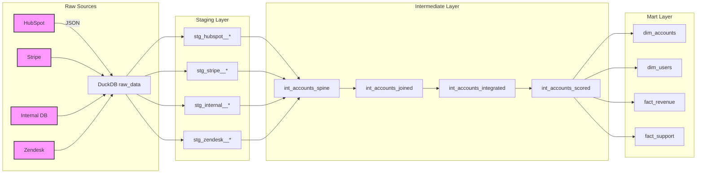

# RevOps Intelligence Engine

## Executive Summary

**RevOps Intelligence Engine** is a unified data platform that stitches together HubSpot (CRM), Stripe (Billing), Internal PostgreSQL (Product), and Zendesk (Support) into a single source of truth for B2B SaaS revenue operations.  The platform powers real‑time health scoring, expansion opportunity detection, churn prevention, and product‑led growth (PLG) signals for go‑to‑market teams.

---

## Core Business Problem

1. **Fragmented Data Silos** – Finance, Sales, and Customer Success each own a separate system with no shared identifier, leading to inconsistent reporting and delayed insight.
2. **Expansion Blind Spot** – Seat‑limit utilization lives only in the internal product DB; sales cannot surface upsell opportunities.
3. **Silent Churn** – Payment failures are visible in Stripe but never surface in HubSpot until the account is already lost.
4. **PLG Leakage** – Activated users are not promoted to Sales qualified leads, causing high churn among trial users.
5. **Inaccurate MRR** – Finance’s MRR calculations ignore mid‑month upgrades and prorations, skewing board‑level metrics.

> *“Net revenue retention is 94 % – we’re bleeding revenue. Where are we losing money and why?”* – Board question that drives this initiative.

---

## Solution Overview

The engine follows a **3‑stage dbt architecture** (Staging → Intermediate → Marts) orchestrated by a lightweight **Dagster** pipeline:

1. **Ingestion (dlt)** – Pulls raw JSON extracts from HubSpot, Stripe, Internal DB, and Zendesk into a DuckDB landing zone (`raw_data` schema).
2. **Staging** – Normalises each source into clean, typed tables (e.g., `stg_hubspot__companies`).
3. **Intermediate (Identity & Integration)** – Resolves a **global account spine** using domain matching, HubSpot ↔ Workspace ↔ Stripe IDs.  This produces `int_accounts_joined`, `int_accounts_integrated`, and health‑scoring models.
4. **Marts** – Exposes business‑ready views such as `dim_accounts`, `dim_users`, `fact_revenue`, and `fact_support` for downstream analytics and Reverse‑ETL.
5. **Reverse‑ETL** – Syncs key health and expansion signals back to HubSpot via `scripts/sync_to_hubspot.py`.

---

## Architecture Diagram



---

## Data Sources (Key Fields)

| Source | Table | Critical Fields |
|---|---|---|
| **HubSpot** | `companies` | `hs_object_id`, `domain` (primary identity), `industry`, `employee_count` |
| **Stripe** | `subscriptions` | `customer_id`, `hubspot_company_id` (metadata), `plan_id`, `quantity`, `status` |
| **Internal DB** | `workspaces` | `id` (workspace_id), `hubspot_company_id`, `stripe_customer_id`, `seat_limit`, `plan` |
| **Zendesk** | `tickets` | `requester_email`, `tags`, `status`, `satisfaction_rating` |

---

## Data Models

### Staging
- `stg_hubspot__companies`
- `stg_stripe__subscriptions`
- `stg_internal__workspaces`
- `stg_zendesk__tickets`

### Intermediate
- **Identity Spine** – unions all possible identifiers (HubSpot, Workspace, Stripe) and generates a surrogate `account_id`.
- `int_accounts_joined` – first pass joining on workspace IDs.
- `int_accounts_integrated` – enriches with HubSpot, Finance, Sales, Support signals.
- `int_accounts_scored` – applies health, churn, and expansion business rules.

### Marts
- `dim_accounts` – one‑row per account with `domain`, `company_name`, `industry`, `segment`, `health_status`, `mrr`, `arr`, `is_ready_for_upsell`.
- `dim_users` – user‑level enrichment for usage and support activity.
- `fact_revenue` – time‑series MRR, churn, expansion revenue.
- `fact_support` – ticket volume, SLA breaches, satisfaction trends.

---

## Key Business Metrics (Generated)

| Metric | Definition |
|---|---|
| **Net Revenue Retention (NRR)** | `(Current MRR + Expansion – Churn) / Starting MRR` |
| **Expansion Opportunity Rate** | `% of accounts where seat_utilization_pct ≥ 90 %` |
| **At‑Risk Score** | Composite of `payment_failed`, `open_tickets > 5`, `last_activity_at < now() - 30d` |
| **Product Qualified Leads (PQL)** | Users with ≥ 1 product event *and* activation flag, surfaced to HubSpot |
| **Support Satisfaction** | Avg `satisfaction_rating` per account segment |

---

## Deployment & Runbook

```bash
# 1️⃣ Generate mock data (development)
./.venv/bin/python scripts/generate_mock_data.py

# 2️⃣ Load raw data into DuckDB
./.venv/bin/python ingestion/stackflow_pipeline.py

# 3️⃣ Build dbt models and run tests
./.venv/bin/dbt build

# 4️⃣ Sync health signals to HubSpot (Reverse‑ETL)
./.venv/bin/python scripts/sync_to_hubspot.py
```

All scripts are container‑agnostic; for production, wrap them in a lightweight Airflow/Dagster DAG and schedule nightly.

---

## Future Enhancements

- **Real‑time Streaming** – Replace batch dlt ingestion with Kafka‑Connect for sub‑second latency.
- **Machine‑Learning Health Scoring** – Train a gradient‑boost model on churn outcomes and replace rule‑based `health_status`.
- **Data Catalog & Lineage** – Integrate with Lightdash or dbt‑docs for self‑serve analytics.
- **Multi‑Tenant Support** – Parameterise the pipeline to ingest multiple SaaS customers.

---

## Contact & Ownership

- **Product Owner:** *Farrux* – `farrux@mycompany.com`
- **Data Engineering Lead:** *[Name]*
- **Analytics Lead:** *[Name]*

---

*This README is version‑controlled and kept in sync with the `dbt` project metadata (profiles.yml, dbt_project.yml). All diagrams are generated from source code to guarantee reproducibility.*
