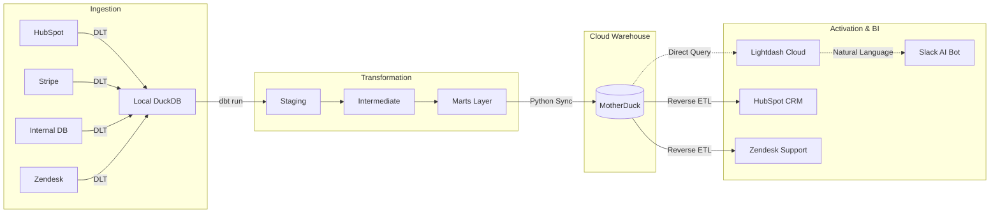

# 🚀 B2B SaaS RevOps Data Intelligence Engine


## 🏢 Executive Summary

**RevOps Intelligence Engine** is an enterprise-grade, end-to-end data platform designed to solve the "Invisible Churn Crisis" and "Data Silo" problems inherent in modern B2B SaaS companies. 

By stitching together fragmented data from **HubSpot** (CRM), **Stripe** (Billing), **Zendesk** (Support), and **Internal Databases** (Product Telemetry), this engine creates a single source of truth. It powers real-time health scoring, expansion opportunity detection (PQLs), accurate MRR calculations, and delivers insights directly to Go-To-Market (GTM) teams via **Reverse ETL** and an autonomous **Slack AI Bot**.

---

## 💼 Business Context (The "Why")

In B2B SaaS, the Revenue Operations (RevOps) team is responsible for driving revenue growth across Sales, Marketing, and Customer Success. However, they often face critical blind spots:

### Core Business Problems
1. **Fragmented Data Silos:** Finance lives in Stripe, Sales in HubSpot, and Success in Zendesk. There is no shared identifier, leading to inconsistent reporting.
2. **The "Silent Churn" Crisis:** Payment failures or drops in product usage are rarely surfaced to Sales until the account is already lost.
3. **Missed Expansion (PLG Leakage):** Seat-limit utilization lives in the product DB; sales cannot see when an account is ready for an upsell.
4. **Inaccurate MRR Reporting:** Traditional CRM reporting ignores mid-month upgrades, prorations, and complex billing logic.

### Key Business Outcomes
This project delivers automated, actionable intelligence to solve these problems:
* **Accurate MRR Waterfall:** Tracks exact revenue movements (New, Expansion, Contraction, Churn) via `fct_mrr_waterfall`.
* **Automated Health Scoring:** Generates an `At-Risk Score` based on payment failures, open support tickets, and low product usage.
* **Product-Led Growth (PQL) Routing:** Identifies accounts with ≥ 90% seat utilization and instantly flags them in HubSpot for Sales to upsell.
* **Data as a Service (DaaS):** Allows executives to ask natural language questions in Slack (e.g., *"What is our Total MRR by Segment?"*) and instantly receive Lightdash visualisations.

---

## 🛠️ Technical Context (The "How")

This project implements the bleeding-edge **Modern Data Stack (MDS)** architecture, optimizing for compute efficiency, speed, and cloud-native deployment.

### 1. Ingestion Layer (DLT)
Raw JSON data is extracted from 4 distinct sources and loaded into a local DuckDB landing zone (`raw_data` schema) using `dlt`. This ensures high-speed, local ingestion without network timeouts.

### 2. Transformation Layer (dbt)
The core logic resides in a 3-stage dbt architecture:
* **Staging:** Type casting, renaming, and deduplication (`stg_hubspot__companies`, `stg_stripe__subscriptions`).
* **Intermediate:** Complex **Identity Stitching** (joining HubSpot ↔ Workspace ↔ Stripe IDs) and domain matching.
* **Marts:** Business-ready dimensional models (`dim_accounts`, `dim_users`) and fact tables (`fct_mrr_waterfall`, `fct_pipeline`).

### 3. Cloud Data Warehouse (MotherDuck)
To save on cloud compute costs (Compute Separation), all heavy transformations run on a local DuckDB instance. Once transformations are complete, the `scripts/sync_to_motherduck.py` script leverages DuckDB's native `ATTACH` mechanism to push the final 28 curated tables to **MotherDuck** (Cloud Data Warehouse) in seconds.

### 4. Semantic Layer & BI (Lightdash)
The engine utilizes dbt `meta` tags inside YAML files to define a robust Semantic Layer. **Lightdash Cloud** reads this Semantic Layer directly from GitHub, automatically generating metrics (Total MRR, Active PQLs) and exposing them via an interactive UI and a Slack AI integration.

### 5. Reverse ETL Layer
Data doesn't just sit in dashboards. Custom Python scripts (`scripts/sync_to_hubspot.py`, `scripts/sync_to_zendesk.py`) query MotherDuck and push actionable insights (e.g., `is_ready_for_upsell = True`) directly back into the operational tools used by the GTM teams.

### 6. Orchestration (Dagster)
The entire pipeline is fully autonomous. A lightweight **Dagster** DAG (`dagster_pipeline.py`) schedules and monitors the workflow daily at 07:00 UTC:
`DLT Ingestion` ➡️ `dbt Build` ➡️ `MotherDuck Sync` ➡️ `Reverse ETL (HubSpot/Zendesk)`

---

## 🏗️ Architecture Diagram



---

## 🚀 Quick Start / Runbook

### Prerequisites
- Python 3.10+
- A [MotherDuck](https://app.motherduck.com) account and `MOTHERDUCK_TOKEN`
- A [Lightdash Cloud](https://lightdash.com) account

### Setup Instructions
1. **Clone the repository and install dependencies:**
   ```bash
   python -m venv .venv
   source .venv/bin/activate
   pip install -r requirements.txt
   ```
2. **Set up Environment Variables:**
   Create a `.env` file in the root directory:
   ```env
   MOTHERDUCK_TOKEN=your_token_here
   HUBSPOT_ACCESS_TOKEN=your_hubspot_token
   ZENDESK_API_TOKEN=your_zendesk_token
   ```
3. **Generate Mock Data:**
   ```bash
   python scripts/generate_mock_data.py
   ```
4. **Run the Autonomous Pipeline (Via Dagster):**
   ```bash
   dagster dev -f dagster_pipeline.py
   # Or run steps manually:
   # python ingestion/stackflow_pipeline.py
   # dbt build
   # python scripts/sync_to_motherduck.py
   # python scripts/sync_to_hubspot.py
   ```

---

## 📁 Repository Structure

```text
├── dagster_pipeline.py       # Orchestration logic
├── dashboard.py              # Streamlit fallback BI dashboard
├── ingestion/
│   └── stackflow_pipeline.py # DLT ingestion scripts
├── models/
│   ├── staging/              # Raw data normalisation
│   ├── intermediate/         # Identity stitching & business logic
│   └── marts/                # Core, Finance, Product, Sales models + schema.yml
├── scripts/
│   ├── sync_to_motherduck.py # Cloud warehouse sync
│   ├── sync_to_hubspot.py    # Reverse ETL to CRM
│   └── sync_to_zendesk.py    # Reverse ETL to Support
├── profiles.yml              # dbt local configuration
└── README.md                 # You are here
```

---

*This project represents a complete, production-ready Modern Data Stack implementation tailored for B2B SaaS revenue operations.*
