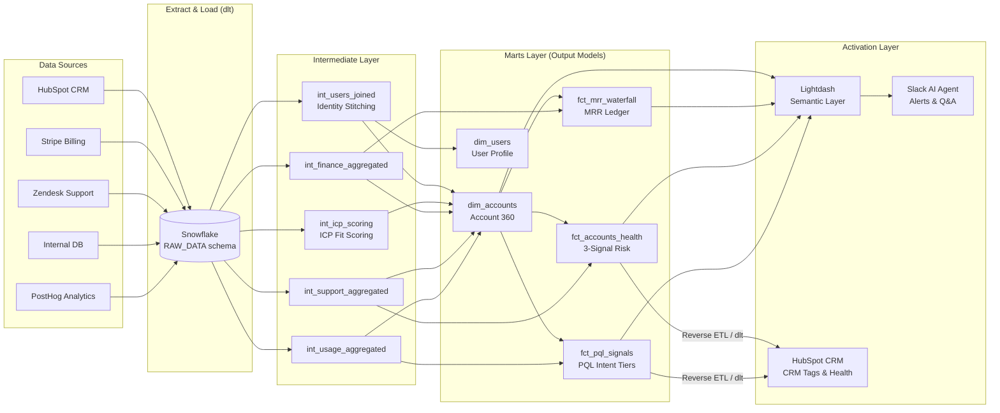
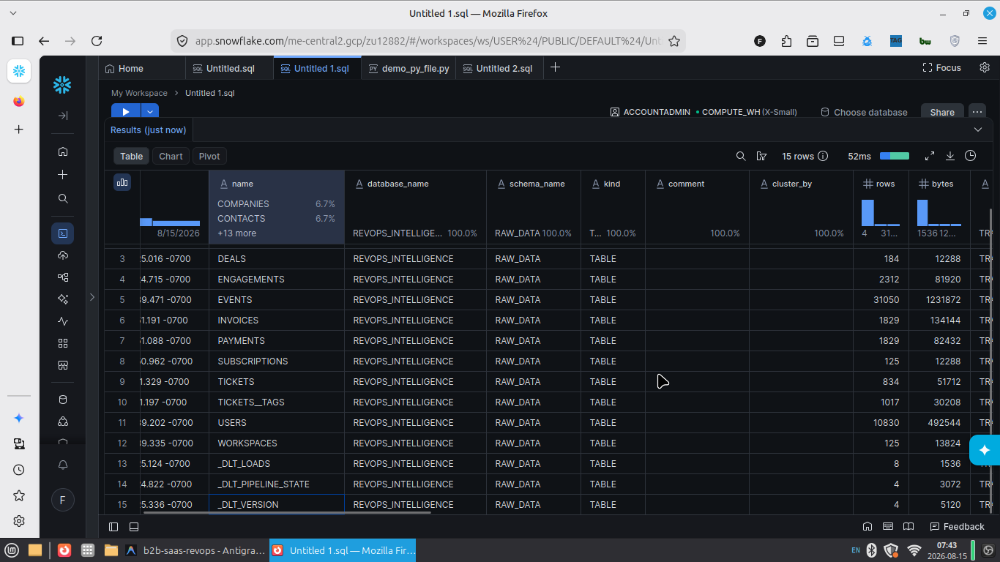
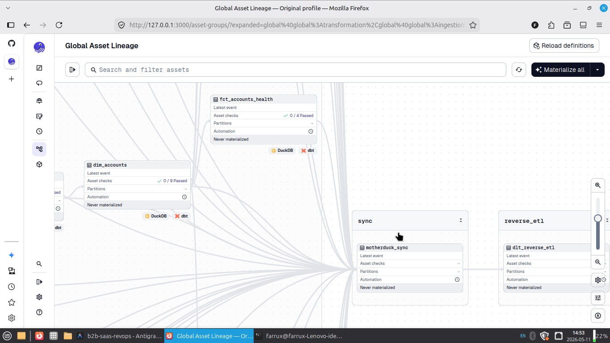

# 🚀 B2B SaaS RevOps Intelligence Engine

> [!IMPORTANT]
> **[View Live Data Documentation & Lineage Graph](https://farrux05-ai.github.io/b2b-saas-revops-intelligence/)**


---

## ⚡ TL;DR — What This Is

> A full-stack **Revenue Operations data pipeline** built on Snowflake and dbt. It unifies CRM, billing, support, and product data into a single source of truth — then delivers insights back into Slack and HubSpot automatically.

| | |
|:-|:-|
| **The problem** | 4 disconnected tools (HubSpot, Stripe, Zendesk, PostHog) — no shared identity, silent churn, inaccurate MRR |
| **The solution** | End-to-end pipeline: ingestion → transformation → semantic layer → Slack AI agent → Reverse ETL back to CRM |
| **The result** | First run surfaced 23 at-risk accounts ($87K at risk). CS saved **$45K ARR in 30 days** |
| **Stack** | dlt · dbt · Snowflake · Dagster · Lightdash · Elementary · Slack Bot |
| **Cost** | $0/month — Snowflake free tier + open-source tools |

---

## Table of Contents

1. [Business Context & Problem](#1--business-context--problem)
2. [Solution & Architecture](#2--solution--architecture)
3. [Extract & Load (Ingestion)](#3--extract--load-ingestion)
4. [Transformation](#4--transformation)
5. [Data Validation & Observability](#5--data-validation--observability)
6. [Semantic Layer + Slack AI Agent](#6--semantic-layer--slack-ai-agent)
7. [BI Reporting](#7--bi-reporting)
8. [Reverse ETL](#8--reverse-etl)
9. [Orchestration](#9--orchestration)
10. [CI/CD](#10--cicd)

---

## 1. 💼 Business Context & Problem

**[StackFlow AI](https://stackflow.ai)** is a B2B SaaS Engineering Management Platform — AI-driven task prioritization, Git-native sprint orchestration, and team velocity tracking. The company raised a **$10M Series A**, crossed **$3M ARR**, and grew from 15 to 60+ employees in under 18 months.

But hyper-growth exposed a structural weakness: **the company was flying blind on its own revenue.**

Each department ran on best-in-class tools — but none of them talked to each other:

| Department | Tool | What They Knew | What They Couldn't See |
|:-----------|:-----|:---------------|:-----------------------|
| Sales | HubSpot | Pipeline, deal stages, rep activity | Whether those deals actually activated in the product |
| Finance | Stripe | MRR, invoices, payment status | Which marketing campaign or sales rep drove each subscription |
| Customer Success | Zendesk | Support tickets, CSAT, escalations | Seat utilization or product engagement of the complaining account |
| Product | Internal DB + PostHog | Git connections, sprint creation, AI usage | The ARR risk tied to low-engagement accounts |

<details>
<summary><strong>📌 Product & Pricing Context</strong></summary>

**Seat-Based Pricing Tiers**

| Tier | Price/Seat/mo | Seat Limit | Target Segment |
|:-----|:-------------|:-----------|:---------------|
| **Starter** | $12 | 10 | Early-stage teams |
| **Growth** | $25 | 50 | Scaling mid-market |
| **Enterprise** | $60 | 500+ | Large orgs, custom contracts |

**The Activation ("Aha!") Moment:** A team connects their Git provider **and** completes their first AI-assisted Sprint. Accounts that hit this milestone churn at 3×-lower rates than those that don't.

**PQL Intent Tiers** *(Product-Qualified Lead scoring)*

| Tier | Criteria | GTM Action |
|:-----|:---------|:-------------|
| 🔥 **HOT** | Git connected + >50 product events in 14 days | Immediate Sales call |
| ⚡ **WARM** | Sprint started + >10 product events | Automated nurture sequence |
| 🔘 **COLD** | Signed up — no activation milestones reached | Marketing onboarding emails |

</details>

---

### What the business was losing every week

The real cost wasn't complexity — it was **silent, preventable revenue loss** across four areas:

**💸 Revenue walking out the door undetected**
A $12K/year Enterprise account cancelled without warning. They had been past-due on Stripe for 3 weeks, had zero Git activity for 6 weeks, and had 4 open high-priority Zendesk tickets. Every team saw one signal. Nobody saw all three. CS only found out after the cancellation email arrived.

**📉 Expansion revenue left on the table**
Finance knew which accounts had unused seats — but couldn't tell Sales. Sales was prospecting cold leads while 30% of existing accounts had >80% seat utilization and were operationally ready to expand. Every week of delay was missed upsell.

**🔢 Board numbers that couldn't be trusted**
The CFO's MRR report was built by hand — a Finance analyst spent 16 hours/month exporting Stripe CSVs into Excel, manually reconciling prorations, mid-month plan changes, and failed payments. The number the CEO presented at board meetings was always 2–3 weeks stale and ±8% inaccurate.

**⏱️ Every metric required an analyst**
When the VP of Sales asked *"Which accounts are 80%+ on seats but haven't expanded?"*, the answer took 3 days. The data existed — in 4 separate systems — but assembling it required a custom SQL query and a manual join nobody had time to write. Decisions were delayed. Opportunities were missed.

> **Result:** The first `dbt build` run surfaced **23 at-risk accounts** representing **$87K ARR**. CS intervened within 48 hours → **$45K saved in 30 days**.

---

## 2. 🏗️ Solution & Architecture

> 📹 **[Watch Section Video](#)** *(coming soon)*

**One pipeline, full loop:** raw API data → Snowflake → dbt models → Slack AI agent → back into HubSpot.



<details>
<summary><strong>🛠️ Full Tech Stack</strong></summary>

| Layer | Tool | Why |
|:------|:-----|:----|
| **Ingestion (Dev)** | `ingestion/stackflow_pipeline.py` (dlt) | Mock data → Snowflake dev target |
| **Ingestion (Prod)** | [`b2b_dlt/`](b2b_dlt/) | Live connectors: HubSpot, Stripe, Zendesk, PostHog, Postgres CDC |
| **Transformation** | [dbt](https://getdbt.com) | DAG-based SQL with tests, docs, lineage on Snowflake |
| **Cloud Warehouse** | [Snowflake](https://www.snowflake.com/) | Enterprise cloud data warehouse |
| **Data Quality** | [Elementary](https://www.elementary-data.com/) | Anomaly detection, test observability, Slack alerts |
| **Semantic Layer** | [Lightdash](https://lightdash.com) | Metrics-as-code from dbt `meta` YAML |
| **Slack AI Agent** | Lightdash AI + Slack Bot | Natural language Q&A — no SQL needed |
| **Orchestration** | [Dagster](https://dagster.io) | Asset-based DAG — tracks *data*, not just *scripts* |
| **Reverse ETL** | Python + dlt | Pushes insights back into HubSpot |
| **CI/CD** | GitHub Actions | dbt slim CI, Elementary checks, dbt docs auto-deploy |

</details>

---

## 3. 📥 Extract & Load (Ingestion)

> 📹 **[Watch Section Video](#)** *(coming soon)*

**[dlt (data load tool)](https://dlthub.com)** ingests from 5 sources into Snowflake's `RAW_DATA` schema — handling schema inference, incremental loading, and pagination automatically.

| Source | Method | Key Tables |
|:-------|:-------|:-----------|
| HubSpot CRM | REST API + Property History | `companies`, `contacts`, `deals` |
| Stripe Billing | REST API (cursor-based) | `subscriptions`, `invoices`, `customers` |
| Zendesk Support | REST API (incremental) | `tickets`, `users`, `organizations` |
| PostHog Events | REST API | `events`, `persons` |
| Internal DB | PostgreSQL CDC (logical replication) | `users`, `workspaces`, `seats` |

### 📸 Execution & Load Verification

**1. `dlt` Ingestion Terminal Output (Snowflake Target):**


**2. Snowflake `RAW_DATA` Schema Load State:**



<details>
<summary><strong>📂 Two-Mode Ingestion (Dev vs Prod)</strong></summary>

| Mode | File | Purpose |
|:-----|:-----|:--------|
| **Dev** | `ingestion/stackflow_pipeline.py` | Reads JSON mock data → Snowflake `DEV_RAW_DATA` schema |
| **Prod** | [`b2b_dlt/main.py`](b2b_dlt/main.py) | Live API connectors → Snowflake `RAW_DATA` schema |

All raw data lands in Snowflake:
```
RAW_DATA.HUBSPOT__COMPANIES
RAW_DATA.HUBSPOT__CONTACTS
RAW_DATA.STRIPE__SUBSCRIPTIONS
RAW_DATA.ZENDESK__TICKETS
...
```
</details>

---

## 4. ⚙️ Transformation

> 📹 **[Watch Section Video](#)** *(coming soon)*

**dbt** transforms raw Snowflake data through a 3-layer medallion architecture into business-ready tables used by BI, Slack, and Reverse ETL.

```
RAW_DATA (Snowflake)
    └── STAGING    ← Views: type-cast, rename, dedupe
            └── INTERMEDIATE  ← Views: identity stitch, domain aggregation
                    └── MARTS ← Tables: facts & dims consumed by downstream
```

### Key Marts

| Model | What it answers |
|:------|:----------------|
| `dim_accounts` | Full account snapshot: MRR, ARR, health, ICP tier, upsell readiness |
| `fct_accounts_health` | 3-signal risk model: payment · engagement · support |
| `fct_mrr_waterfall` | New / Expansion / Contraction / Churn / Resurrection per account/month |
| `fct_pql_signals` | HOT / WARM / COLD intent scoring per workspace |
| `fct_retention_cohorts` | NRR, GRR, logo churn by monthly cohort |

<details>
<summary><strong>📐 Full Data Model Map (all 13 marts)</strong></summary>

| Model | Grain | Key Metrics / Fields |
|:------|:------|:---------------------|
| `dim_accounts` | 1 row/account | `mrr`, `arr`, `health_status`, `icp_tier`, `is_ready_for_upsell`, `seat_utilization_pct` |
| `dim_users` | 1 row/user | `global_user_id`, `hubspot_contact_id`, `user_role` |
| `dim_dates` | 1 row/calendar day | Date spine for all time-series joins |
| `fct_accounts_health` | 1 row/paying account | 3-signal health model: payment · engagement · support |
| `fct_mrr_waterfall` | 1 row/account/month | `new_mrr`, `expansion_mrr`, `contraction_mrr`, `churn_mrr` |
| `fct_arr_movements` | 1 row/account/month | `arr_start`, `arr_end`, `arr_change_type` |
| `fct_pql_signals` | 1 row/workspace | `intent_tier` (HOT/WARM/COLD), `recommended_action` |
| `fct_pipeline` | 1 row/deal | `deal_stage`, `amount`, `win_probability`, `avg_won_days_to_close` |
| `fct_subscriptions` | 1 row/subscription | Subscription state, `seat_utilization_pct`, `is_upsell_candidate` |
| `fct_product_activation` | 1 row/account | Activation milestones, `activation_rate` |
| `fct_retention_cohorts` | 1 row/month | NRR, GRR, Logo Churn by cohort |
| `fct_trial_conversion` | 1 row/trial | `is_converted`, `time_to_convert_days`, `is_at_risk_of_expiring` |
| `fct_unit_economics` | 1 row/account segment | LTV, LTV:ARR ratio, avg NRR/GRR |

</details>

<details>
<summary><strong>🔬 Critical Business Logic (health scoring, MRR waterfall, identity resolution)</strong></summary>

**Health Score — 3-Signal Additive Risk Model** (`fct_accounts_health`)

Any 2+ signals = `At Risk`:
```sql
is_payment_failing = (subscription_status = 'past_due')
is_churning_soon   = (cancel_at_period_end = true)
is_low_engagement  = (DATEDIFF('day', last_activity_at, CURRENT_DATE) > 30)

health_status = CASE
    WHEN subscription_status = 'canceled' THEN 'Churned'
    WHEN (is_payment_failing + is_churning_soon + is_low_engagement) >= 2 THEN 'At Risk'
    ELSE 'Healthy'
END
```

**MRR Waterfall Movement Types** (`fct_mrr_waterfall`)

| Type | Definition |
|:-----|:-----------|
| `new` | First subscription this month |
| `expansion` | MRR increased vs. prior month |
| `contraction` | MRR decreased (not $0) |
| `churn` | MRR → $0 (canceled) |
| `resurrection` | MRR returned after $0 |

**Identity Resolution** (`int_users_joined`) — hierarchical fallback:
```sql
match_method = CASE
  WHEN u.stripe_customer_id IS NOT NULL THEN 'direct_id'
  WHEN h.hubspot_contact_id IS NOT NULL THEN 'email_match'
  WHEN c.hubspot_company_id IS NOT NULL THEN 'domain_l2a'
  ELSE 'unresolved'
END
```
</details>

---

## 5. 🧪 Data Validation & Observability

> 📹 **[Watch Section Video](#)** *(coming soon)*

**160 dbt tests** run inline on every `dbt build`. [Elementary](https://www.elementary-data.com/) monitors anomalies between runs and posts failures directly to Slack.

| Layer | Count | Type |
|:------|:------|:-----|
| Schema tests | ~130 | `unique`, `not_null`, `accepted_values` |
| Relationship tests | ~15 | FK integrity across marts |
| Custom SQL assertions | ~15 | Business logic correctness |

**Elementary monitors:** row count drops · freshness delays · schema drift · test failure trends → `#data-alerts`

<details>
<summary><strong>📋 Source Freshness SLAs & Composite Key Tests</strong></summary>

**Source Freshness SLAs**

| Source | Warn After | Error After |
|:-------|:-----------|:------------|
| Product Events (PostHog) | 2 hours | 6 hours |
| HubSpot (leads/deals) | 6 hours | 24 hours |
| Stripe (billing) | 12 hours | 48 hours |
| Zendesk (tickets) | 24 hours | 48 hours |

**Key composite key tests:**
- `fct_mrr_waterfall`: `unique_combination_of_columns(account_id, month_date)`
- `fct_arr_movements`: `unique(arr_snapshot_id)`

```bash
# Run dbt tests
dbt build --target snowflake --store-failures

# Run Elementary observability report
edr report --target snowflake

# Push failures to Slack
edr send-report --slack-token $SLACK_TOKEN --slack-channel data-alerts
```
</details>

---

## 6. 🧠 Semantic Layer + Slack AI Agent

> 📹 **[Watch Section Video](#)** *(coming soon)*

**The problem:** Every business question required an analyst to write SQL — days of delay. GTM teams made decisions on stale data.

**The solution:** Metrics defined once in dbt YAML → Lightdash semantic layer → Slack AI bot answers questions in plain English, directly from Snowflake.

```
"How many at-risk accounts this week?"
  → Slack Bot → Lightdash → Snowflake
  → "14 accounts — $63K MRR at risk 📊"
```

No SQL. No BI tool login. No analyst in the loop.

<details>
<summary><strong>📊 Metric Definitions by Domain</strong></summary>

| Schema File | Models Covered | Key Metrics |
|:------------|:--------------|:------------|
| `core_schema.yml` | `dim_accounts`, `dim_users` | `total_arr`, `total_mrr`, `avg_seat_utilization` |
| `cs_schema.yml` | `fct_accounts_health` | `at_risk_accounts`, `total_mrr_at_risk`, `upsell_ready_cs` |
| `finance_schema.yml` | `fct_mrr_waterfall`, `fct_retention_cohorts` | `total_new_mrr`, `total_churn_mrr`, `avg_nrr`, `avg_grr`, `avg_ltv` |
| `sales_schema.yml` | `fct_pipeline` | `total_pipeline_value`, `weighted_pipeline_value`, `stale_deals` |
| `product_schema.yml` | `fct_product_activation`, `fct_trial_conversion` | `pql_workspaces`, `converted_trials`, `avg_time_to_convert` |
| `marketing_schema.yml` | `fct_lead_funnel`, `fct_attribution` | `total_leads`, `mqls`, `conversion_rate` |

> **Convention:** Finance metrics use `_movements` suffix (e.g. `total_arr_movements`) to avoid collision with `total_arr` on `dim_accounts`.

**ICP × Intent Matrix**

| | High Intent | Low Intent |
|:--|:-----------|:-----------|
| **High ICP Fit** | 🎯 MUST WIN — Sales call | 📧 NURTURE — Marketing email |
| **Low ICP Fit** | 👀 MONITOR — Track usage | 🔕 DEPRIORITIZE |
</details>

---

## 7. 📊 BI Reporting

> 📹 **[Watch Section Video](#)** *(coming soon)*

**[Lightdash](https://lightdash.com)** connects directly to Snowflake via the dbt semantic layer. No separate metric definitions needed.

| Dashboard | Audience | Answers |
|:----------|:---------|:--------|
| Revenue Overview | Finance / CEO | MRR Waterfall, NRR/GRR trend, ARR movements |
| Account Health | Customer Success | At-risk list, signal breakdown, save plays |
| PQL Pipeline | Sales | HOT/WARM/COLD intent, ICP × Intent matrix |
| Product Activation | Product | Activation funnel, trial conversion, seat utilization |
| Sales Pipeline | Sales | Deal stage funnel, weighted pipeline, days-to-close |

> All dashboards registered in `models/marts/exposures.yml` — dbt lineage shows exactly which dashboards depend on which models.

---

## 8. 🔄 Reverse ETL

> 📹 **[Watch Section Video](#)** *(coming soon)*

Insights computed in Snowflake are pushed **back into HubSpot** so GTM teams act without leaving their CRM.

| What gets pushed | HubSpot Property | Who acts |
|:-----------------|:----------------|:---------|
| `fct_pql_signals.intent_tier` | `pql_intent_tier` | Sales — triggers outreach sequences |
| `fct_accounts_health.health_status` | `health_status` | CS — triggers save plays |
| `dim_accounts.is_ready_for_upsell` | `is_upsell_candidate` | Sales — triggers expansion workflows |
| `dim_accounts.arr` | `current_arr` | Finance / Sales — deal context |

```
Snowflake → scripts/reverse_etl_dlt.py → HubSpot Companies API ✅
```

→ **[Full Step-by-Step Demo](REVERSE_ETL_DEMO.md)**

<details>
<summary><strong>⚙️ Implementation Details</strong></summary>

```bash
# Dry run (preview without API calls)
python scripts/reverse_etl_dlt.py --dry-run

# Live run
python scripts/reverse_etl_dlt.py

# Target specific resources
python scripts/reverse_etl_dlt.py --resource companies
python scripts/reverse_etl_dlt.py --resource pql
```

> **Identity requirement:** Only accounts with `match_method != 'unresolved'` in `int_users_joined` can receive Reverse ETL enrichment. Unresolved accounts must be manually reconciled in HubSpot first.
</details>

---

## 9. ⚙️ Orchestration

> 📹 **[Watch Section Video](#)** *(coming soon)*

**[Dagster](https://dagster.io)** runs the full pipeline daily at 07:00 UTC as an asset-based DAG — tracking data freshness, not just script execution.

```
07:00 UTC  →  Step 1: Ingest (dlt → Snowflake RAW_DATA)
           →  Step 2: Transform + Test (dbt build + Elementary on Snowflake)
           →  Step 3: Reverse ETL (Snowflake → HubSpot)
```

```bash
# Launch Dagster UI
dagster dev -f dagster_pipeline.py
# → http://localhost:3000
```

### 📸 Asset Lineage Graph



---

## 10. 🔁 CI/CD

> 📹 **[Watch Section Video](#)** *(coming soon)*

Every Pull Request triggers automated quality gates via **GitHub Actions**.

| Workflow | Trigger | Action |
|:---------|:--------|:-------|
| `dbt_slim_ci.yml` | PR open/update | Build only changed models + downstream on Snowflake |
| `elementary_checks.yml` | PR open/update | Run data quality checks → post results as PR comment |
| `dbt_docs_deploy.yml` | Merge to `main` | Generate + deploy dbt docs to GitHub Pages |

**Slim CI** only rebuilds what changed — fast CI even at scale:
```bash
dbt build --select state:modified+ --defer --state ./prod-artifacts --target snowflake
```

> **Live Docs:** Every merge auto-deploys to **[farrux05-ai.github.io/b2b-saas-revops-intelligence](https://farrux05-ai.github.io/b2b-saas-revops-intelligence/)**

---

## 📁 Repository Structure

<details>
<summary><strong>Expand full structure</strong></summary>

```
b2b-saas-revops/
├── dagster_pipeline.py           # Orchestration: jobs, assets, daily schedule
├── b2b_dlt/                      # 🌐 PRODUCTION ELT: Live API pipelines → Snowflake
│   ├── main.py                   # Production pipeline orchestrator CLI
│   ├── hubspot/                  # HubSpot CRM live API connector
│   ├── stripe_analytics/         # Stripe payments live API connector
│   ├── zendesk/                  # Zendesk incremental API connector
│   └── pg_replication/           # PostgreSQL CDC logical replication
├── ingestion/
│   └── stackflow_pipeline.py     # 🧪 DEV ELT: dlt pipeline (mock data → Snowflake)
├── models/
│   ├── staging/                  # 8 source-aligned views
│   ├── intermediate/             # Identity resolution + domain aggregation
│   ├── marts/
│   │   ├── core/                 # dim_accounts, dim_users, dim_dates
│   │   ├── finance/              # fct_mrr_waterfall, fct_arr_movements
│   │   ├── customer_success/     # fct_accounts_health
│   │   ├── sales/                # fct_pipeline
│   │   ├── marketing/            # fct_lead_funnel, fct_attribution
│   │   └── exposures.yml         # Lightdash dashboard lineage
│   └── utilities/dim_dates.sql
├── snapshots/                    # SCD Type 2 (HubSpot companies, Stripe subscriptions)
├── seeds/                        # icp_industry_scores.csv, icp_segment_scores.csv
├── tests/                        # assert_health_status_logic_consistent.sql
├── scripts/
│   ├── reverse_etl_dlt.py        # Snowflake → HubSpot (dlt custom destination)
│   └── generate_mock_data.py
├── macros/                       # dbt Jinja macros
├── .github/workflows/            # CI/CD pipelines
├── dbt_project.yml
├── profiles.yml                  # Snowflake connection profiles
└── docs/
    ├── TECHNICAL.md
    ├── DEPLOYMENT.md
    └── CASE_STUDY.md             # $45K ARR saved story
```
</details>

---

## 🚀 Quick Start

```bash
git clone https://github.com/farrux05-ai/b2b-saas-revops-intelligence.git
cd b2b-saas-revops-intelligence
uv venv .venv && source .venv/bin/activate
uv pip install -r requirements.txt

cp .env.example .env
# Set: SNOWFLAKE_ACCOUNT, SNOWFLAKE_USER, SNOWFLAKE_PASSWORD, HUBSPOT_ACCESS_TOKEN, SLACK_TOKEN

# Run via Dagster UI (recommended)
dagster dev -f dagster_pipeline.py   # → http://localhost:3000

# Or manually:
python ingestion/stackflow_pipeline.py       # 1. Ingest
dbt build --target snowflake                 # 2. Transform + Test
edr report --target snowflake                # 3. Observability report
python scripts/reverse_etl_dlt.py           # 4. Push to HubSpot
```

---

## 🔗 Related Docs

| | |
|:-|:-|
| [Technical Deep-Dive](docs/TECHNICAL.md) | Architecture decisions, model patterns, testing philosophy |
| [Deployment Runbook](docs/DEPLOYMENT.md) | Snowflake setup, Lightdash config, CI/CD, Dagster scheduling |
| [Case Study](docs/CASE_STUDY.md) | $45K ARR saved in 30 days — full story |
| [Reverse ETL Demo](REVERSE_ETL_DEMO.md) | Step-by-step live pipeline walkthrough |
| [Live dbt Docs](https://farrux05-ai.github.io/b2b-saas-revops-intelligence/) | Interactive lineage graph + column docs |

---

*Built on the Enterprise Modern Data Stack. Designed to drive revenue, not just dashboards.*
