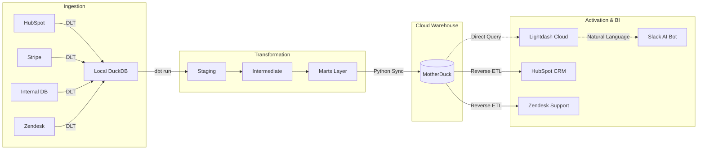

# 🚀 B2B SaaS RevOps Data Intelligence Engine

> [!IMPORTANT]
> **[View Live Data Documentation & Lineage Graph](https://farrux05-ai.github.io/b2b-saas-revops-intelligence/)**


## 🏢 Executive Summary

**RevOps Intelligence Engine** is an enterprise-grade data platform designed to transform the Data Warehouse from a traditional **"Cost Center"** (just building dashboards) into a proactive **"Revenue Center"** (driving actual business outcomes).

By stitching together fragmented data from **HubSpot** (CRM), **Stripe** (Billing), **Zendesk** (Support), and **Internal Databases** (Product Telemetry), this engine creates a unified Lead-to-Account identity. It powers real-time health scoring, advanced Product-Qualified Lead (PQL) detection, and delivers actionable insights directly back to Go-To-Market (GTM) teams via **Reverse ETL**.

---

## 💼 Business Context (The "Why")

In B2B SaaS, the Revenue Operations (RevOps) team is responsible for driving revenue growth across Sales, Marketing, and Customer Success. However, they often face critical blind spots:

### Core Business Problems

1. **Fragmented Data Silos:** Finance lives in Stripe, Sales in HubSpot, and Success in Zendesk. There is no shared identifier, leading to inconsistent reporting.
2. **The "Silent Churn" Crisis:** Payment failures or drops in product usage are rarely surfaced to Sales until the account is already lost.
3. **Missed Expansion (PLG Leakage):** Seat-limit utilization lives in the product DB; sales cannot see when an account is ready for an upsell.
4. **Inaccurate MRR Reporting:** Traditional CRM reporting ignores mid-month upgrades, prorations, and complex billing logic.

### Key Business Outcomes (Revenue Center Philosophy)

This project moves beyond passive reporting by delivering automated, actionable intelligence:

- **Reverse ETL (Operational Analytics):** We don't just build dashboards. `sync_to_hubspot.py` pushes critical data back into the CRM, directly triggering Sales workflows.
- **Product-Led Growth (PQL) Engine:** The `fct_pql_signals` model identifies high-intent trial accounts (e.g., connected Git, >50 events) and categorizes them into Tiers (🔥 HOT, WARM, COLD), instantly alerting Sales to upsell opportunities.
- **Stopping "Invisible Churn":** Automated health scoring generates an `At-Risk` flag based on payment failures, support friction, and declining usage, enabling CS to intervene *before* the customer cancels.
- **Accurate MRR Waterfall:** Tracks exact revenue movements (New, Expansion, Contraction, Churn, Resurrection) via `fct_mrr_waterfall`, providing Finance with a trustworthy, immutable ledger.

---

## 📦 The Product: StackFlow AI

To understand the data, we must understand the product. This engine simulates **StackFlow AI**, an enterprise-grade **Engineering Management Platform** designed for high-growth software teams.

### Core Product Features:
*   **AI Prioritization:** Automatically ranks engineering tasks based on business impact.
*   **Git-Native Workflow:** Deep integration with GitHub/GitLab to track code velocity.
*   **Sprint Orchestration:** Automated sprint planning and retrospective tools.
*   **Team Capacity Planning:** Real-time visibility into engineering bandwidth.

### The "Aha! Moment" (Activation):
The product's value is fully realized when a team **connects their Git provider** and **starts their first AI-assisted Sprint**. These are the critical "Activation Milestones" tracked by our PQL engine.

---

## 💰 Business Logic & Revenue Model

This project simulates a **B2B SaaS platform** with a **Hybrid GTM (Go-To-Market)** strategy, combining self-serve efficiency with enterprise sales precision.

### 1. Pricing Structure (Seat-Based)
The revenue model is based on **Per-User (Seat)** pricing across three distinct tiers. This creates a natural "Expansion" lever as customers grow.

| Tier | Price (Per Seat/mo) | Seat Limit | Target Segment |
| :--- | :--- | :--- | :--- |
| **Starter** | $12.00 | 10 | Early-stage teams & individuals |
| **Growth** | $25.00 | 50 | Rapidly scaling mid-market teams |
| **Enterprise** | $60.00 | 500+ | Large organizations with complex needs |

*   **Trial Period:** 14-day free trial on the Starter/Growth plans.
*   **Expansion Trigger:** Accounts exceeding 85% of their seat limit are automatically flagged for an Upsell outreach.

### 2. Sales Motion: Product-Led Sales (PLS)
Instead of a traditional "cold" sales approach, this engine powers a **Product-Led Sales** motion. It uses product telemetry to prioritize human effort where it has the highest ROI.

*   **PQL Scoring (Intent):**
    *   **🔥 HOT:** User activated "Git Integration" AND performed >50 product events.
    *   **⚡ WARM:** User started a "Sprint" AND performed >10 product events.
    *   **🔘 COLD:** Signed up but hasn't reached key activation milestones.
*   **GTM Priority Matrix (Intent x Fit):**
    The engine combines **Product Intent** (from usage) with **ICP Fit** (from HubSpot company data like industry/size) to generate a Priority Score:
    *   **MUST WIN:** High Fit + High Intent (Immediate Sales Outreach).
    *   **NURTURE:** High Fit + Low Intent (Automated Marketing Emails).
    *   **RECOVERY:** High Fit + Declining Usage (Customer Success Intervention).

---

## 🖼️ Visual Pipeline & Dashboards

### 1. Orchestration Layer (Dagster)
The entire data lifecycle is orchestrated using **Dagster**. This asset-based approach ensures data lineage and observability across the entire stack.


### 2. Business Intelligence (Lightdash)
We use **Lightdash** as our primary BI tool. It connects directly to our dbt project, allowing us to define metrics in code and visualize them in real-time.


### 3. Operational Analytics (Reverse ETL)
Closing the loop by pushing health scores and PQL signals back into **HubSpot** via a custom Reverse ETL pipeline.


---

## 🛠️ Technical Context (The "How")

> [!TIP]
> For a deep-dive into the architectural decisions, cost analysis, and scalability of this stack, see the **[Technical Deep-Dive](docs/TECHNICAL.md)**.

This project implements the bleeding-edge **Modern Data Stack (MDS)** architecture, optimizing for compute efficiency, speed, and cloud-native deployment.

### 1. Ingestion Layer (DLT)

Raw JSON data is extracted from 4 distinct sources and loaded into a local DuckDB landing zone (`raw_data` schema) using `dlt`. This ensures high-speed, local ingestion without network timeouts.

### 2. Transformation Layer (dbt)

The core logic resides in a 3-stage dbt architecture:

- **Staging:** Type casting, renaming, and deduplication (`stg_hubspot__companies`, `stg_stripe__subscriptions`).
- **Intermediate:** Complex **Identity Stitching** (joining HubSpot ↔ Workspace ↔ Stripe IDs) and domain matching.
- **Marts:** Business-ready dimensional models (`dim_accounts`, `dim_users`) and fact tables (`fct_mrr_waterfall`, `fct_pipeline`).

### 3. Cloud Data Warehouse (MotherDuck)

To save on cloud compute costs (Compute Separation), all heavy transformations run on a local DuckDB instance. Once transformations are complete, the `scripts/sync_to_motherduck.py` script leverages DuckDB's native `ATTACH` mechanism to push the final 28 curated tables to **MotherDuck** (Cloud Data Warehouse) in seconds.

### 4. Semantic Layer & BI (Lightdash)

The engine utilizes dbt `meta` tags inside YAML files to define a robust Semantic Layer. **Lightdash Cloud** reads this Semantic Layer directly from GitHub, automatically generating metrics (Total MRR, Active PQLs) and exposing them via an interactive UI and a Slack AI integration.

### 5. Reverse ETL Layer

Data doesn't just sit in dashboards. Custom Python scripts (`scripts/sync_to_hubspot.py`, `scripts/sync_to_zendesk.py`) query MotherDuck and push actionable insights (e.g., `is_ready_for_upsell = True`) directly back into the operational tools used by the GTM teams.

### 6. Orchestration (Dagster)

The entire pipeline is fully autonomous. A lightweight **Dagster** DAG (`dagster_pipeline.py`) schedules and monitors the workflow daily at 07:00 UTC:
`DLT Ingestion` ➡️ `dbt Build` ➡️ `MotherDuck Sync` ➡️ `Reverse ETL (HubSpot/Zendesk)`

---

## 🏗️ Architecture Diagram



---

## 🚀 Quick Start / Runbook

### Prerequisites

- Python 3.10+
- A [MotherDuck](https://app.motherduck.com) account and `MOTHERDUCK_TOKEN`
- A [Lightdash Cloud](https://lightdash.com) account

### Setup Instructions

1. **Clone the repository and install dependencies:**
    ```bash
    python -m venv .venv
    source .venv/bin/activate
    pip install -r requirements.txt
    ```
2. **Set up Environment Variables:**
   Create a `.env` file in the root directory:
    ```env
    MOTHERDUCK_TOKEN=your_token_here
    HUBSPOT_ACCESS_TOKEN=your_hubspot_token
    ZENDESK_API_TOKEN=your_zendesk_token
    ```
3. **Generate Mock Data:**
    ```bash
    python scripts/generate_mock_data.py
    ```
4. **Run the Autonomous Pipeline (Via Dagster):**
    ```bash
    dagster dev -f dagster_pipeline.py
    # Or run steps manually:
    # python ingestion/stackflow_pipeline.py
    # dbt build
    # python scripts/sync_to_motherduck.py
    # python scripts/sync_to_hubspot.py
    ```

---

## 📁 Repository Structure

```text
├── dagster_pipeline.py       # Orchestration logic
├── dashboard.py              # Streamlit fallback BI dashboard
├── ingestion/
│   └── stackflow_pipeline.py # DLT ingestion scripts
├── models/
│   ├── staging/              # Raw data normalisation
│   ├── intermediate/         # Identity stitching & business logic
│   └── marts/                # Core, Finance, Product, Sales models + schema.yml
├── scripts/
│   ├── sync_to_motherduck.py # Cloud warehouse sync
│   ├── sync_to_hubspot.py    # Reverse ETL to CRM
│   └── sync_to_zendesk.py    # Reverse ETL to Support
├── profiles.yml              # dbt local configuration
└── README.md                 # You are here
```

---

_This project represents a complete, production-ready Modern Data Stack implementation tailored for B2B SaaS revenue operations._

