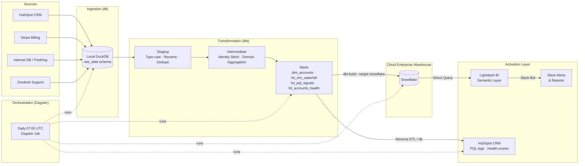

# 🚀 B2B SaaS RevOps Intelligence Engine

> [!IMPORTANT]
> **[View Live Data Documentation & Lineage Graph](https://farrux05-ai.github.io/b2b-saas-revops-intelligence/)**


---

## 🏢 Executive Summary

**RevOps Intelligence Engine** transforms the data warehouse from a passive **"Cost Center"** (just building dashboards) into a proactive **"Revenue Center"** (driving measurable business outcomes).

By unifying fragmented data from **HubSpot** (CRM), **Stripe** (Billing), **Zendesk** (Support), and **Internal Databases** (Product Telemetry), this engine creates a single Lead-to-Account identity graph, powers real-time health scoring and PQL detection, and delivers actionable insights directly into GTM tools via **Reverse ETL** — all with a fully automated, observable pipeline.

> **Bottom line:** The first `dbt run` surfaced 23 at-risk accounts representing $87K in jeopardy. CS intervened, saving $45K in ARR within 30 days.

---

## 💼 Business Context

### Core Problems Solved

| Problem | Root Cause | Our Solution |
|:--------|:-----------|:-------------|
| **Fragmented Silos** | Finance in Stripe, Sales in HubSpot, CS in Zendesk — no shared ID | Identity resolution via `int_users_joined` + `int_icp_scoring` |
| **Silent Churn** | Payment failures and usage drops go undetected until cancellation | `fct_accounts_health` health scoring with 3-signal risk model |
| **PLG Leakage** | Seat utilization lives in product DB; Sales can't see upsell readiness | `fct_pql_signals` intent tier (🔥 HOT / ⚡ WARM / 🔘 COLD) |
| **Inaccurate MRR** | CRM reports ignore prorations, mid-month upgrades, churn timing | `fct_mrr_waterfall` tracks exact New / Expansion / Contraction / Churn movements |

### Revenue Center Philosophy

This project goes beyond dashboards. Every model exists to trigger an action:

- **`fct_pql_signals`** → Reverse ETL → HubSpot PQL tag → Sales outreach
- **`fct_accounts_health`** → `health_status = At Risk` → CS intervention before cancellation
- **`dim_accounts.is_ready_for_upsell`** → `seat_utilization ≥ 90%` → Expansion workflow
- **`fct_mrr_waterfall`** → Finance MRR ledger → Accurate board reporting

---

## 📦 The Product: StackFlow AI

This engine is built around **StackFlow AI**, an enterprise Engineering Management Platform.

| Feature | Description |
|:--------|:------------|
| AI Prioritization | Ranks engineering tasks by business impact |
| Git-Native Workflow | Deep GitHub/GitLab integration |
| Sprint Orchestration | Automated planning and retrospectives |
| Team Capacity Planning | Real-time bandwidth visibility |

**Activation (Aha!) Moment:** A team connects their Git provider **and** completes their first AI-assisted Sprint. These milestones are the foundation of our PQL scoring.

---

## 💰 Revenue & Pricing Model

### Pricing Tiers (Seat-Based)

| Tier | Price/Seat/mo | Seat Limit | Target Segment |
|:-----|:-------------|:-----------|:---------------|
| **Starter** | $12 | 10 | Early-stage teams |
| **Growth** | $25 | 50 | Scaling mid-market |
| **Enterprise** | $60 | 500+ | Large orgs |

- **Trial:** 14-day free on Starter/Growth
- **Expansion trigger:** Seat utilization ≥ 85% → upsell flag

### PQL Intent Tiers

| Tier | Criteria | GTM Action |
|:-----|:---------|:-----------|
| 🔥 **HOT** | Git connected + >50 product events | Immediate Sales outreach |
| ⚡ **WARM** | Sprint started + >10 product events | Automated nurture sequence |
| 🔘 **COLD** | Signed up, no activation milestones | Marketing onboarding emails |

### ICP Fit × Intent Matrix

| | High Intent | Low Intent |
|:--|:-----------|:-----------|
| **High ICP Fit** | 🎯 MUST WIN — Sales call | 📧 NURTURE — Marketing email |
| **Low ICP Fit** | 👀 MONITOR — Track usage | 🔕 DEPRIORITIZE |

---

## 🏗️ Architecture



---

## 🛠️ Tech Stack

| Layer | Tool | Why |
|:------|:-----|:----|
| **Ingestion (Mock Dev)** | `ingestion/stackflow_pipeline.py` | Local dlt pipeline reading reproducible JSON mock data for fast dev & testing |
| **Ingestion (Live Prod)** | [`b2b_dlt/`](b2b_dlt/) | Production dlt pipeline orchestrator connecting to live APIs (HubSpot, Stripe, Zendesk, PostHog, Postgres CDC) |
| **Transformation** | [dbt](https://getdbt.com) | DAG-based SQL with built-in testing, docs, and lineage |
| **Local Compute** | [DuckDB](https://duckdb.org) | Zero-server OLAP, 100M+ rows on a laptop, $0 compute cost |
| **Cloud Warehouse** | [MotherDuck](https://motherduck.com) / Snowflake | Serverless DuckDB cloud & enterprise Snowflake production targets |
| **Semantic Layer** | [Lightdash](https://lightdash.com) | Reads dbt `meta` YAML directly — metrics defined in code |
| **Orchestration** | [Dagster](https://dagster.io) | Asset-based DAG — tracks *data*, not just *scripts* |
| **Reverse ETL** | Python + dlt | Closes the loop: pushes insights back into HubSpot |

**Cost:** $0/month infrastructure. Local compute + free tiers of all cloud tools.

---

## 📐 Data Model Map

### Staging Layer (`main_staging`) — Views
Raw source data normalized, type-cast, and renamed.

| Model | Source | Key Output |
|:------|:-------|:-----------|
| `stg_hubspot__companies` | HubSpot | `hubspot_company_id`, `domain` |
| `stg_hubspot__contacts` | HubSpot | `hubspot_contact_id`, `email`, `linkedin_profile_url` |
| `stg_hubspot__deals` | HubSpot | `hubspot_deal_id`, `deal_stage`, `amount` |
| `stg_stripe__subscriptions` | Stripe | `subscription_id`, `mrr`, `subscription_status` |
| `stg_stripe__invoices` | Stripe | `invoice_id`, `is_past_due` |
| `stg_zendesk__tickets` | Zendesk | `ticket_id`, `priority`, `is_open` |
| `stg_posthog__events` | PostHog | `event_type`, `workspace_id`, `event_timestamp` |
| `stg_internal__users` | Internal DB | `user_id`, `email`, `workspace_id` |

### Intermediate Layer (`main_intermediate`) — Views

| Model | Purpose | Critical Logic |
|:------|:--------|:--------------|
| `int_users_joined` | **Identity Stitching** | Joins internal users ↔ HubSpot contacts via email; fallback domain matching |
| `int_icp_scoring` | **ICP Fit Scoring** | Scores accounts by industry + company size using seed tables |
| `int_subscriptions_enriched` | **Subscription enrichment** | Joins Stripe subscriptions with workspace and plan metadata |
| `int_finance_aggregated` | **Finance domain aggregation** | Rolls up MRR, invoices, payment status per account |
| `int_support_aggregated` | **Support domain aggregation** | Rolls up ticket counts, priorities, resolution time per account |
| `int_usage_aggregated` | **Usage domain aggregation** | Rolls up product events, activation flags per account |

### Marts Layer (`main_marts`) — Tables

| Model | Grain | Key Metrics / Fields |
|:------|:------|:---------------------|
| `dim_accounts` | 1 row/account | `mrr`, `arr`, `health_status`, `icp_tier`, `is_ready_for_upsell`, `seat_utilization_pct` |
| `dim_users` | 1 row/user | `global_user_id`, `hubspot_contact_id`, `user_role` |
| `dim_dates` | 1 row/calendar day | Date spine for all time-series joins |
| `fct_accounts_health` | 1 row/paying account | 3-signal health model: payment · engagement · support |
| `fct_mrr_waterfall` | 1 row/account/month | `new_mrr`, `expansion_mrr`, `contraction_mrr`, `churn_mrr` |
| `fct_arr_movements` | 1 row/account/month | `arr_start`, `arr_end`, `arr_change_type` |
| `fct_pql_signals` | 1 row/workspace | `intent_tier` (HOT/WARM/COLD), `recommended_action` |
| `fct_pipeline` | 1 row/deal | `deal_stage`, `amount`, `win_probability`, `avg_won_days_to_close` |
| `fct_subscriptions` | 1 row/subscription | Current subscription state, `seat_utilization_pct`, `is_upsell_candidate` |
| `fct_product_activation` | 1 row/account | Activation milestones, `activation_rate` |
| `fct_activities` | 1 row/engagement | HubSpot engagement history |
| `fct_retention_cohorts` | 1 row/month | Monthly cohorts: NRR (Net Revenue Retention), GRR (Gross Revenue Retention), Logo Churn |
| `fct_trial_conversion` | 1 row/trial subscription | Trial-to-paid funnel: `is_converted`, `time_to_convert_days`, `is_at_risk_of_expiring` |
| `fct_unit_economics` | 1 row/account segment | Segment level economics: LTV (Lifetime Value), LTV:ARR ratio, avg NRR/GRR |

---

## ⚠️ Critical Business Logic

### 1. Health Score Algorithm (`fct_accounts_health`)

The health score uses a **3-signal additive risk model**. Any 2+ signals = `At Risk`.

```sql
-- Signal 1: Payment Failing (is_payment_failing)
-- TRUE when latest Stripe invoice status = 'past_due'
is_payment_failing = (subscription_status = 'past_due')

-- Signal 2: Intent to Churn (is_churning_soon)
-- TRUE when Stripe subscription cancel_at_period_end = TRUE
is_churning_soon = (cancel_at_period_end = true)

-- Signal 3: Low Engagement (is_low_engagement)
-- TRUE when last_activity_at IS NULL OR > 30 days ago
is_low_engagement = (
    last_activity_at IS NULL
    OR DATEDIFF('day', last_activity_at, CURRENT_DATE) > 30
)

-- Final Classification
health_status =
  CASE
    WHEN subscription_status = 'canceled' THEN 'Churned'
    WHEN (CAST(is_payment_failing AS INT)
        + CAST(is_churning_soon AS INT)
        + CAST(is_low_engagement AS INT)) >= 2 THEN 'At Risk'
    ELSE 'Healthy'
  END
```

> **Alert:** Only accounts with `subscription_status IS NOT NULL` (paying accounts) appear in `fct_accounts_health`. Trials are excluded.

### 2. MRR Waterfall Logic (`fct_mrr_waterfall`)

Each row captures the **reason for MRR change** per account per month. The composite unique key is `(account_id, month_date)`.

| Movement Type | Definition |
|:-------------|:-----------|
| `new` | First-ever subscription in this month |
| `expansion` | MRR increased vs. prior month |
| `contraction` | MRR decreased vs. prior month (not $0) |
| `churn` | MRR went to $0 (subscription canceled) |
| `resurrection` | MRR returned after being $0 |

> **Alert:** `fct_mrr_waterfall` has a `unique_combination_of_columns` test on `(account_id, month_date)`. If this test fails, it means a subscription was double-counted — investigate immediately.

### 3. Seat Utilization & Upsell Flag (`dim_accounts`)

```sql
seat_utilization_pct = ROUND(seats_used / NULLIF(seats_purchased, 0), 4)

is_ready_for_upsell = (seat_utilization_pct >= 0.90)
```

> **Alert:** `NULLIF(seats_purchased, 0)` prevents division-by-zero. Any account with `seats_purchased = 0` will show `NULL` utilization — these are legacy accounts pre-dating the seat model and should be excluded from expansion campaigns.

### 4. Identity Resolution Priority (`int_users_joined`)

The stitching uses a **hierarchical fallback** — highest confidence first:

1. **Direct ID match** — `stripe_customer_id` mapped via internal DB
2. **Email match** — `stg_internal__users.email = stg_hubspot__contacts.email`
3. **Domain L2A** — `stg_hubspot__companies.domain = SPLIT_PART(email, '@', 2)`

```sql
match_method = CASE
  WHEN u.stripe_customer_id IS NOT NULL THEN 'direct_id'
  WHEN h.hubspot_contact_id IS NOT NULL THEN 'email_match'
  WHEN c.hubspot_company_id IS NOT NULL THEN 'domain_l2a'
  ELSE 'unresolved'
END
```

> **Alert:** Records with `match_method = 'unresolved'` are users who exist in the product but have no HubSpot representation. They cannot receive Reverse ETL enrichment until manually reconciled.

### 5. ICP Scoring (`int_icp_scoring`)

ICP (Ideal Customer Profile) fit is computed from two seed tables:

- `seeds/icp_industry_scores.csv` — industry-level fit score (0–10)
- `seeds/icp_segment_scores.csv` — company size segment fit score (0–10)

```sql
icp_score = industry_score + segment_score  -- Max: 20

icp_tier = CASE
  WHEN icp_score >= 15 THEN 'Tier 1'
  WHEN icp_score >= 10 THEN 'Tier 2'
  ELSE 'Tier 3'
END
```

### 6. NRR / GRR Cohort calculations (`fct_retention_cohorts`)

Net Revenue Retention (NRR) and Gross Revenue Retention (GRR) are measured monthly:

```sql
-- GRR: Revenue retained without expansions (capped at 100%)
grr_pct = LEAST((starting_mrr - churned_mrr - contraction_mrr) / starting_mrr, 1.0) * 100

-- NRR: Revenue retained including expansions (can exceed 100%)
nrr_pct = (starting_mrr - churned_mrr - contraction_mrr + expansion_mrr) / starting_mrr * 100
```

### 7. Unit Economics / LTV Estimation (`fct_unit_economics`)

Since marketing CAC spend is unavailable, we estimate Customer Lifetime Value (LTV) using historical churn benchmarks:

```sql
-- Churn-based LTV estimate
estimated_ltv = avg_mrr_per_account / (avg_monthly_churn_rate_pct / 100.0)

-- LTV to ARR Ratio (Target: > 3.0x for healthy SaaS)
ltv_arr_ratio = estimated_ltv / (avg_mrr_per_account * 12)
```

---


## 🔄 Pipeline Execution Order

```
[07:00 UTC Daily — Dagster Schedule]

1. ingestion_dlt        → Pulls fresh data from HubSpot, Stripe, Zendesk, Internal DB
                          into raw_data schema (local DuckDB)

2. revops_dbt_assets    → dbt source freshness   (halt if stale > 48h)
                          dbt build --store-failures
                          └── Seeds → Snapshots → Staging → Intermediate → Marts
                          └── 160 data tests run inline

3. motherduck_sync      → ATTACH local DB to MotherDuck
                          COPY 40 tables in dependency order:
                          raw_data → main_marts → main_staging

4. dlt_reverse_etl      → Reads fct_pql_signals + dim_accounts from DuckDB
                          Pushes to HubSpot via custom dlt destination
```

> **Dependency Order in MotherDuck Sync:** `raw_data` must sync before `main_staging` because staging views reference raw tables by name. If staging syncs first, the view evaluator cannot find the raw columns (e.g., `linkedin_url`), causing a Binder Error.

---

## 🧪 Data Quality & Testing

**160 dbt tests** run on every `dbt build`. Tests are organized in 3 layers:

| Layer | Count | Examples |
|:------|:------|:---------|
| **Schema tests** | ~130 | `unique`, `not_null`, `accepted_values` |
| **Relationship tests** | ~15 | `fct_mrr_waterfall.account_id` → `dim_accounts.account_id` |
| **Custom assertions** | ~15 | `assert_health_status_logic_consistent.sql` |

**Key composite key tests:**
- `fct_mrr_waterfall`: `unique_combination_of_columns(account_id, month_date)`
- `fct_arr_movements`: `unique(arr_snapshot_id)`

**Source freshness SLAs:**

| Source | Warn After | Error After |
|:-------|:-----------|:------------|
| Product Events (PostHog) | 2 hours | 6 hours |
| HubSpot (leads/deals) | 6 hours | 24 hours |
| Stripe (billing) | 12 hours | 48 hours |
| Zendesk (tickets) | 24 hours | 48 hours |

---

## 🚀 Quick Start

### Prerequisites
- Python 3.10+
- [MotherDuck](https://app.motherduck.com) account + token
- [Lightdash Cloud](https://lightdash.com) account + API token

### Setup

```bash
# 1. Clone and install
git clone https://github.com/farrux05-ai/b2b-saas-revops-intelligence.git
cd b2b-saas-revops-intelligence
python -m venv .venv && source .venv/bin/activate
pip install -r requirements.txt

# 2. Configure environment
cp .env.example .env
# Edit .env: set MOTHERDUCK_TOKEN, HUBSPOT_ACCESS_TOKEN

# 3. Generate mock data (seeds the local DuckDB)
python scripts/generate_mock_data.py

# 4. Run the full pipeline
dagster job execute -f dagster_pipeline.py -j revops_ingestion_job
dagster job execute -f dagster_pipeline.py -j revops_transform_job

# Or run steps manually:
python ingestion/stackflow_pipeline.py     # 1. Ingest
dbt build --store-failures                 # 2. Transform + Test
python scripts/reverse_etl_dlt.py         # 3. Push to HubSpot
```

### Run with Dagster UI (Recommended)

```bash
dagster dev -f dagster_pipeline.py
# Open http://localhost:3000
```

---

## 📁 Repository Structure

```
b2b-saas-revops/
├── dagster_pipeline.py           # Orchestration: jobs, assets, daily schedule
├── b2b_dlt/                      # 🌐 PRODUCTION ELT: Multi-source live API pipelines (dlt)
│   ├── main.py                   # Production pipeline orchestrator CLI
│   ├── pipelines/                # Live connectors (hubspot, stripe, zendesk, posthog, pg_replication)
│   ├── hubspot/                  # HubSpot CRM live API connector + property history
│   ├── stripe_analytics/         # Stripe payments live API connector
│   ├── zendesk/                  # Zendesk incremental API connector
│   └── pg_replication/           # PostgreSQL CDC logical replication
├── ingestion/
│   └── stackflow_pipeline.py     # 🧪 LOCAL DEV ELT: dlt pipeline (mock data reader)
├── models/
│   ├── staging/                  # 8 source-aligned views (type-cast, rename)
│   │   ├── stg_hubspot/
│   │   ├── stg_stripe/
│   │   ├── stg_zendesk/
│   │   └── stg_internal/
│   ├── intermediate/             # Business logic + identity resolution
│   │   ├── 1_identity/           # int_users_joined (ID stitching)
│   │   ├── 2_domains/            # Finance, Support, Usage aggregation
│   │   └── schemas/              # intermediate_schema.yml
│   ├── marts/
│   │   ├── core/                 # dim_accounts, dim_users, dim_dates + core_schema.yml
│   │   ├── finance/              # fct_mrr_waterfall, fct_arr_movements + finance_schema.yml
│   │   ├── customer_success/     # fct_accounts_health + cs_schema.yml
│   │   ├── sales/                # fct_pipeline + sales_schema.yml
│   │   ├── marketing/            # fct_lead_funnel, fct_attribution + marketing_schema.yml
│   │   └── exposures.yml         # Lightdash dashboard exposure tracking
│   └── utilities/
│       └── dim_dates.sql         # Date spine (date_day PK: unique + not_null)
├── snapshots/                    # SCD Type 2 (HubSpot companies, Stripe subscriptions)
├── seeds/
│   ├── icp_industry_scores.csv   # ICP fit by industry (0–10 score)
│   └── icp_segment_scores.csv    # ICP fit by company size segment (0–10 score)
├── tests/
│   └── assert_health_status_logic_consistent.sql
├── scripts/
│   ├── reverse_etl_dlt.py        # dlt custom destination → HubSpot API
│   └── generate_mock_data.py     # Realistic mock data seeder
├── macros/                       # dbt Jinja macros (business logic reuse)
├── dbt_project.yml               # dbt project config
├── profiles.yml                  # dbt DuckDB connection profile
├── packages.yml                  # dbt packages (dbt_utils, dbt_expectations)
├── .env.example                  # Environment variable template
└── docs/
    ├── TECHNICAL.md              # Architectural decisions & deep-dives
    ├── DEPLOYMENT.md             # Deployment runbook (MotherDuck, Lightdash, CI)
    └── CASE_STUDY.md             # Business impact story ($45K saved)
```

---

## 📊 Lightdash Semantic Layer

All metrics and dimensions are defined in `*_schema.yml` files using dbt `meta` tags. Lightdash reads these directly — no duplicate metric definitions.

| Schema File | Models Covered | Key Metrics |
|:------------|:--------------|:------------|
| `core_schema.yml` | `dim_accounts`, `dim_users`, `dim_dates` | `total_arr`, `total_mrr`, `avg_seat_utilization` |
| `cs_schema.yml` | `fct_accounts_health` | `at_risk_accounts`, `total_mrr_at_risk`, `upsell_ready_cs`, `low_engagement_accounts` |
| `finance_schema.yml` | `fct_mrr_waterfall`, `fct_arr_movements`, `fct_retention_cohorts`, `fct_unit_economics` | `total_arr_movements`, `total_new_mrr`, `total_churn_mrr`, `avg_nrr`, `avg_grr`, `avg_ltv` |
| `sales_schema.yml` | `fct_pipeline` | `total_pipeline_value`, `weighted_pipeline_value`, `benchmark_days_to_close`, `stale_deals` |
| `product_schema.yml` | `fct_product_activation`, `fct_feature_usage`, `fct_trial_conversion` | `total_workspaces`, `pql_workspaces`, `total_trials`, `converted_trials`, `avg_time_to_convert` |
| `marketing_schema.yml` | `fct_lead_funnel`, `fct_attribution` | `total_leads`, `mqls`, `conversion_rate` |

> **Metric naming convention:** Finance metrics use the `_movements` suffix (e.g., `total_arr_movements`) to avoid collision with the `total_arr` metric defined on `dim_accounts` in `core_schema.yml`.

---

## 🔗 Related Documentation

| Document | Contents |
|:---------|:---------|
| [Technical Deep-Dive](docs/TECHNICAL.md) | Architectural decisions, data model patterns, testing philosophy, common pitfalls |
| [Deployment Runbook](docs/DEPLOYMENT.md) | Lightdash setup, MotherDuck config, CI/CD, Dagster scheduling |
| [Case Study](docs/CASE_STUDY.md) | Business impact story — $45K ARR saved in 30 days |
| [Live dbt Docs](https://farrux05-ai.github.io/b2b-saas-revops-intelligence/) | Interactive model lineage graph + column documentation |

---

*Built with the Modern Data Stack. Designed to power revenue teams, not just dashboards.*
