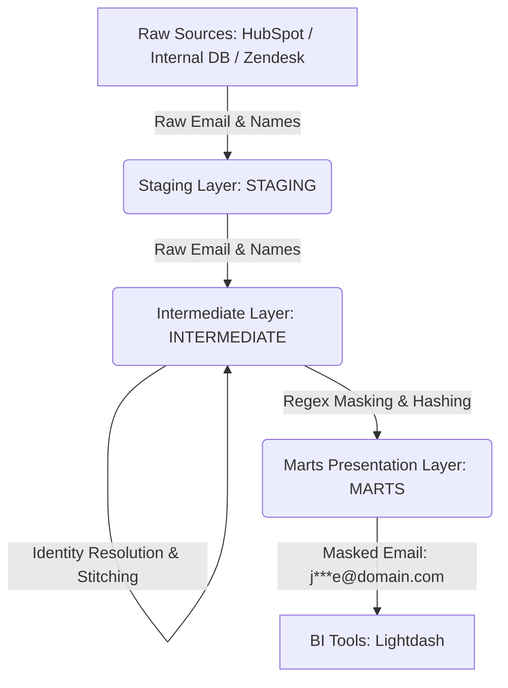

# Technical Deep-Dive: B2B SaaS RevOps Pipeline

This document explains the **why** behind every architectural decision, with implementation details for Analytics Engineers.

---

## Table of Contents

1. [Stack Rationale](#stack-rationale)
2. [Data Model Design](#data-model-design)
3. [dbt Layer Strategy](#dbt-layer-strategy)
4. [Performance Optimizations](#performance-optimizations)
5. [Testing & Data Quality](#testing--data-quality)
6. [Semantic Layer (Lightdash)](#semantic-layer-lightdash)
7. [Common Pitfalls & Solutions](#common-pitfalls--solutions)
8. [PII & Compliance Strategy](#pii--compliance-strategy)
9. [B2B SaaS Metrics Architecture](#b2b-saas-metrics-architecture)

---

## Stack Rationale

### ❄️ Enterprise Choice: Snowflake Cloud Data Warehouse

**Decision:** Use **Snowflake** as the single, unified compute and storage warehouse for all environments (dev, CI, and prod).

**Reasoning:**
1.  **Unified Governance & Lineage:** All raw tables (`RAW_DATA`), staging models (`STAGING`), intermediate joins (`INTERMEDIATE`), and presentation marts (`MARTS`) live within a single Snowflake database with role-based access control (RBAC).
2.  **SQL Dialect Consistency:** Avoids dialect translation bugs (e.g. `PARSE_JSON() / VARIANT`, `QUALIFY` window clauses) between dev and prod environments.
3.  **High-Performance OLAP:** Snowflake's columnar engine handles high-concurrency queries from Lightdash and Elementary effortlessly.
4.  **Zero-Copy Cloning & Schema Isolation:** CI pipelines use isolated schemas (`MARTS_CI`) without duplicating storage overhead.

---

### 🛠️ Tool-by-Tool Explanation

| Tool | Role | Why this tool? |
| :--- | :--- | :--- |
| **dlt** | **Ingestion** | Open-source, Python-native. Handles schema evolution automatically — if HubSpot adds a column, dlt adds it to Snowflake `RAW_DATA` without intervention. |
| **dbt** | **Transformation** | Industry-standard SQL DAG with built-in testing, documentation, and lineage running directly on Snowflake. |
| **Snowflake** | **Cloud Warehouse** | Enterprise cloud data warehouse powering high-performance analytics, role-based security, and seamless scaling. |
| **Elementary** | **Data Observability** | Automated anomaly detection (volume, freshness, schema drift) with test result tracking and Slack alerting. |
| **Dagster** | **Orchestration** | Asset-based DAG (vs. Airflow's task-based). Tracks the *data* produced, providing per-asset lineage and failure context. |
| **Lightdash** | **Semantic Layer & BI** | Reads dbt `meta` YAML directly from Snowflake. Metrics defined once in code appear in Lightdash automatically. |
| **dlt (Reverse ETL)** | **Activation** | Custom `@dlt.destination` reads processed insights from Snowflake `MARTS` and writes MRR/PQL signals to HubSpot API. |

---

### Why dbt over Raw SQL Scripts?

**Decision:** Use dbt for transformations instead of custom Python/pandas or raw SQL scripts.

**Reasoning:**
*   **Modular DAG:** dbt builds dependencies automatically using `ref()`. Changing an upstream staging model automatically updates downstream marts.
*   **Testing as Code:** Data contracts are enforced inline during `dbt build`. Failing rows are saved to audit schemas (`MARTS_DBT_TEST__AUDIT`).
*   **Auto Documentation:** Generates interactive column lineage graphs automatically deployed to GitHub Pages.

---

## Data Model Design

### Medallion Architecture (3 Layers)

```
RAW_DATA (Snowflake)
    └── STAGING (main_staging)       ← Views: type-cast, rename, dedupe
            └── INTERMEDIATE (main_intermediate) ← Views: identity stitching & domain rollups
                    └── MARTS (main_marts)        ← Tables: query-ready facts & dimensions
```

### Core Marts Summary

| Mart Model | Purpose | Key Columns |
|:-----------|:--------|:------------|
| `dim_accounts` | Single Lead-to-Account record | `account_id`, `mrr`, `arr`, `health_status`, `icp_tier`, `is_ready_for_upsell` |
| `fct_accounts_health` | 3-signal health risk scoring | `account_id`, `is_payment_failing`, `is_churning_soon`, `is_low_engagement`, `health_status` |
| `fct_mrr_waterfall` | Monthly MRR movement ledger | `account_id`, `month_date`, `new_mrr`, `expansion_mrr`, `contraction_mrr`, `churn_mrr` |
| `fct_pql_signals` | PLG intent scoring per workspace | `workspace_id`, `intent_tier` (HOT/WARM/COLD), `recommended_action`, `gtm_priority` |
| `fct_retention_cohorts` | Retention & churn metrics | `cohort_month`, `starting_mrr`, `nrr_pct`, `grr_pct`, `logo_churn_pct` |

---

## Common Pitfalls & Solutions

### Pitfall 1: Lightdash Metric Name Collision

**Symptom:** A metric defined in `finance_schema.yml` silently disappears from Lightdash, or a different model's metric appears instead.

**Cause:** Two schema files define a metric with the same name (e.g., `total_arr` in both `core_schema.yml` on `dim_accounts` and `finance_schema.yml` on `fct_arr_movements`). Lightdash's metric registry is global — the second definition overwrites the first.

**Fix:** Rename the finance metric to `total_arr_movements` to create a unique namespace:
```yaml
# finance_schema.yml
metrics:
  total_arr_movements:          # ✅ unique name
    type: sum
    label: "Total ARR (Movements)"
```

---

### Pitfall 2: Reverse ETL Mock Mode Detection

**Symptom:** `401 Unauthorized` errors in `reverse_etl_dlt.py` during local development when `.env` contains a placeholder token.

**Cause:** Original mock detection only checked for the literal string `"mock_token"`. A realistic placeholder like `pat-na1-xxxx-xxxx-xxxx-xxxx` was not caught.

**Fix applied in `reverse_etl_dlt.py`:**
```python
# Catches all placeholder patterns safely
is_mock = HUBSPOT_ACCESS_TOKEN == "mock_token" or "xxxx" in HUBSPOT_ACCESS_TOKEN
```

---

### Pitfall 3: Snowflake Test Failure Inspection

**Symptom:** `dbt build` reports a test failure on Snowflake, but you need to inspect the failing rows for root-cause analysis.

**Solution:** dbt is executed with `--store-failures`. Failing rows are automatically saved in Snowflake:
```sql
SELECT * 
FROM REVOPS_INTELLIGENCE.MARTS_DBT_TEST__AUDIT.UNIQUE_COMBINATION_OF_COLUMNS_FCT_MRR_WATERFALL_ACCOUNT_ID__MONTH_DATE;
```

---

## PII & Compliance Strategy

### 🔒 Privacy-by-Design Architecture

To comply with **GDPR** and **CCPA** regulations, our data platform implements a strict **PII (Personally Identifiable Information) masking policy** at the presentation layer.



### Masking in Presentation Layer (`dim_users`)

```sql
regexp_replace(email, '^([^@]{1})[^@]*([^@]{1})@', '\1***\2@') as email
-- Input:  john.doe@company.com
-- Output: j***e@company.com
```

---

*For deployment setup, see [DEPLOYMENT.md](DEPLOYMENT.md).*
*For business case study, see [CASE_STUDY.md](CASE_STUDY.md).*