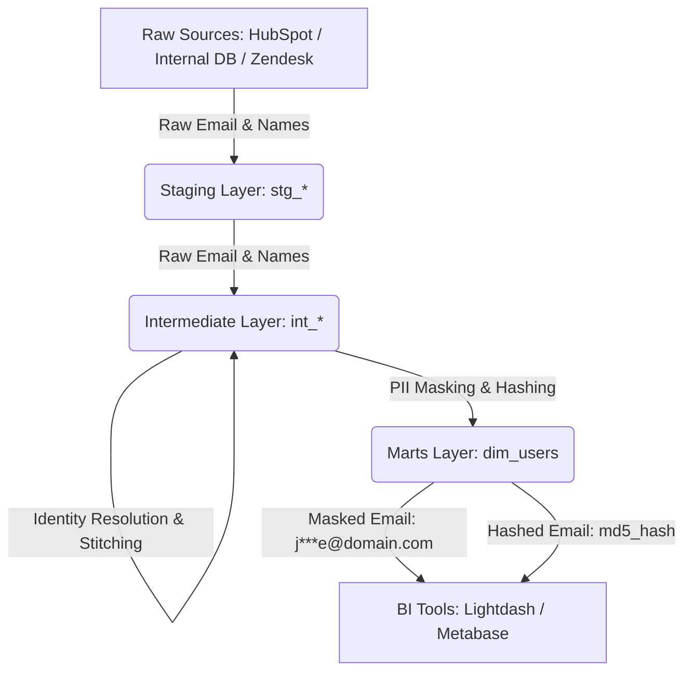

# Technical Deep-Dive: B2B SaaS RevOps Pipeline

This document explains the **why** behind every architectural decision, with implementation details for other Analytics Engineers.

---

## Table of Contents

1. [Stack Rationale](#stack-rationale)
2. [Data Model Design](#data-model-design)
3. [dbt Layer Strategy](#dbt-layer-strategy)
4. [Performance Optimizations](#performance-optimizations)
5. [Testing Philosophy](#testing-philosophy)
6. [Semantic Layer (Lightdash)](#semantic-layer-lightdash)
7. [Common Pitfalls & Solutions](#common-pitfalls--solutions)
8. [PII & Compliance Strategy](#pii--compliance-strategy)

---

## Stack Rationale

### 🦆 The "Hybrid" Choice: DuckDB + MotherDuck

**Decision:** Run heavy transformations on **Local DuckDB** and persist analytics to **MotherDuck (Cloud)**.

**Reasoning:**
1.  **Compute Separation:** All the "heavy lifting" (running dbt build) happens on your local machine (using local CPU/RAM). This costs **$0** in cloud compute bills.
2.  **Persistence & BI:** Once models are built locally, the final Marts are synced to **MotherDuck**. This allows **Lightdash** and other cloud tools to query the data without needing a local file connection.
3.  **Hybrid Execution:** If you have a massive dataset in the cloud and a small one locally, you can join them seamlessly using MotherDuck's `ATTACH` mechanism.

**Cost Analysis:**
*   **Infrastructure Cost:** $0/mo. (Using Free tiers of MotherDuck, Lightdash Cloud, and local compute).
*   **Alternative (Snowflake/BigQuery):** Starting at $200-$500/mo for a similar small-scale setup due to storage and minimal compute charges.

**Scalability & Limits:**
*   **How much can it handle?** DuckDB can easily process **100M+ rows** on a standard laptop. 
*   **When to migrate?** This stack is sufficient for a SaaS startup from Seed to Series B (approx. $1M - $20M ARR). You only need to migrate to Snowflake if you have **concurrent writing** needs from 10+ different engineers or your raw data exceeds **1TB**.

---

### 🛠️ Tool-by-Tool Explanation

| Tool | Role | Why this tool? |
| :--- | :--- | :--- |
| **dlt** | **Ingestion** | Open-source, Python-native. Handles schema evolution automatically — if HubSpot adds a column, dlt adds it to DuckDB without any intervention. |
| **dbt** | **Transformation** | Industry-standard SQL DAG with built-in testing, documentation, and lineage. Turns fragmented SQL into a maintainable model graph. |
| **DuckDB** | **Local Compute** | Zero-server OLAP engine. Processes 100M+ rows on a laptop. $0 compute cost during transformation. |
| **MotherDuck** | **Cloud Warehouse** | Serverless DuckDB-in-the-cloud. Solves the file-sharing problem: Lightdash and other tools can query it without needing the local `.duckdb` file. |
| **Dagster** | **Orchestration** | Asset-based DAG (vs. Airflow's task-based). Tracks the *data* produced, not just whether a script ran. Provides per-asset lineage and failure context. |
| **Lightdash** | **Business Intelligence + Semantic Layer** | Reads dbt `meta` YAML directly. Metrics defined once in code appear in Lightdash automatically — no duplicate definitions, no drift. |
| **dlt (Reverse ETL)** | **Activation** | Closes the loop. Custom `@dlt.destination` pushes PQL signals and health scores back into HubSpot, turning the warehouse into a revenue system. |

---

### Why dbt over Raw SQL Scripts?

**Decision:** Use dbt for transformations instead of Python/pandas or SQL scripts

**Reasoning:**

| Requirement | Raw SQL | dbt |
|-------------|---------|-----|
| **Dependency management** | Manual ORDER BY execution | Automatic DAG resolution |
| **Incrementality** | Custom `WHERE` logic | `{{ is_incremental() }}` macro |
| **Testing** | Separate test scripts | Inline `schema.yml` tests |
| **Documentation** | Separate docs | Auto-generated from YAML |
| **Modularity** | Copy-paste reuse | `{{ ref('model') }}` |

**Example:** Adding a new `stg_zendesk_tickets` model

Raw SQL approach:
```sql
-- Must remember: Run AFTER stg_accounts.sql
-- Must remember: Add to test suite
-- Must remember: Update documentation
CREATE TABLE stg_zendesk_tickets AS 
SELECT ...;
```

dbt approach:

```sql
-- models/staging/stg_support/stg_zendesk_tickets.sql
{{ config(materialized='view') }}

SELECT 
  ticket_id,
  account_id,  -- dbt validates this exists in stg_accounts
  created_at
FROM {{ source('raw', 'zendesk_tickets') }}
```


dbt automatically:
- Runs this AFTER `stg_accounts` (dependency graph)
- Tests `account_id` relationships (if defined in `schema.yml`)
- Documents the model (shows in `dbt docs`)

---

### Why Streamlit over Evidence.dev/Tableau?

**Decision:** Use Streamlit for BI layer

**Comparison:**

| Tool | Strengths | Weaknesses |
|------|-----------|------------|
| **Evidence.dev** | Code-first, Git-native, beautiful defaults | Newer tool, smaller community |
| **Tableau** | Enterprise features, drag-and-drop | Expensive ($70/user/mo), not code-first |
| **Streamlit** | Python-native, infinite flexibility | State management needs care |

**Why Streamlit won:**
- **Python Integration** - Direct access to the DuckDB file using Python logic, no separate build step needed.
- **Dynamic Interactivity** - Better support for complex filtering and cross-filtering compared to static SSGs.
- **Custom Components** - Ability to use Plotly, Altair, or custom HTML/JS if needed.
- **Ecosystem** - Massive community and library support for any visual edge-case.

**Example Dashboard code:**
```python
import streamlit as st
import duckdb

# Database connection (MotherDuck or Local)
conn = duckdb.connect('duckdb/revops_intelligence.duckdb', read_only=True)

# Query
data = conn.execute("SELECT month, SUM(mrr) FROM main_marts.fct_mrr_waterfall GROUP BY 1").df()

# Viz
st.line_chart(data, x='month', y='mrr')
```

This approach allows for a "BI-as-Code" experience while staying within the Python ecosystem.

---

## Data Model Design

### The Account-Centric Star Schema

**Core principle:** Every fact table has `account_id` as a foreign key to `dim_accounts`.

**Why account-centric, not user-centric?**

B2B SaaS decisions happen at the **account level**:
- Pricing/discounts → Account
- Churn risk → Account (one user churning ≠ account churn)
- Expansion opportunities → Account
- Health scores → Account

Even product usage (user-level) is **aggregated to account** for business metrics.

### Dimensional Modeling Principles

**Fact tables = measurements that change**
- `fct_revenue` - MRR per account per month (grain: account × month)
- `fct_pipeline` - Deal progression (grain: one opportunity)
- `fct_product_events` - Aggregated usage (grain: account × day)

**Dimension tables = attributes that change slowly**
- `dim_accounts` - Account properties (name, segment, MRR, health)
- `dim_contacts` - Contact info (name, email, role)
- `dim_dates` - Calendar attributes (day, month, quarter, is_weekend)

### Handling 1:N Relationships

**Problem:** One account has many invoices, many tickets, many contacts.

**Wrong approach:** Join directly in `dim_accounts`
```sql
-- ❌ This creates duplicates!
SELECT a.account_id, a.account_name,
       i.invoice_id, i.amount,
       t.ticket_id, t.status
FROM stg_accounts a
LEFT JOIN stg_invoices i USING (account_id)  -- 5 invoices → 5 rows
LEFT JOIN stg_tickets t USING (account_id)   -- 3 tickets → 15 rows!
```

Result: Account appears 15 times (5 invoices × 3 tickets).

**Correct approach:** Aggregate first, then join
```sql
-- ✅ Aggregate to account level
WITH invoices_agg AS (
  SELECT account_id,
         COUNT(*) AS total_invoices,
         SUM(amount) AS total_revenue
  FROM stg_invoices
  GROUP BY account_id
),
tickets_agg AS (
  SELECT account_id,
         COUNT(*) AS total_tickets,
         AVG(hours_to_first_response) AS avg_response_hours
  FROM stg_tickets
  GROUP BY account_id
)

SELECT a.account_id,
       a.account_name,
       i.total_revenue,
       t.avg_response_hours
FROM stg_accounts a
LEFT JOIN invoices_agg i USING (account_id)
LEFT JOIN tickets_agg t USING (account_id)
```

Result: One row per account, metrics aggregated.

**Implementation:** This pattern is in `models/intermediate/2_domains/int_finance_aggregated.sql`

---

## dbt Layer Strategy

### Three-Layer Architecture

```
staging/ → intermediate/ → marts/
```

**Layer 1: Staging (Views)**

Purpose: Clean, standardize, rename


```sql
-- models/staging/stg_finance/stg_subscriptions.sql
{{ config(materialized='view') }}

SELECT 
  subscription_id,
  account_id,
  CAST(mrr AS DECIMAL(10,2)) AS mrr,               -- Type casting
  LOWER(status) AS subscription_status,             -- Standardization
  created_at AS subscription_start_date,            -- Renaming
  CASE 
    WHEN status = 'active' AND due_date < CURRENT_DATE 
    THEN TRUE ELSE FALSE 
  END AS is_past_due                                -- Flagging
FROM {{ source('raw', 'stripe_subscriptions') }}
WHERE deleted_at IS NULL                            -- Soft delete filter
```


**Why views, not tables?**
- No storage duplication
- Always reflects latest raw data
- Fast dbt compile time (no materialization wait)

**Trade-off:** Downstream models query the view, so complex staging logic slows down marts. Keep staging simple.

---

**Layer 2: Intermediate (Views/Tables)**

Purpose: Join sources, apply **Identity Resolution** (Stitching), and business logic.

**Sub-layers:**
1.  **`1_identity`**: Stitching HubSpot IDs to internal User/Workspace IDs.
2.  **`2_domains`**: Aggregating domain-specific metrics (Finance, Support, Product).
3.  **`3_integration`**: Final combined views ready for Marts.


```sql
-- models/intermediate/1_identity/int_users_joined.sql
{{ config(materialized='view') }}

SELECT 
  u.user_id,
  u.email,
  h.hubspot_contact_id,
  COALESCE(u.workspace_id, h.hubspot_company_id) as unified_account_id
FROM {{ ref('stg_internal__users') }} u
LEFT JOIN {{ ref('stg_hubspot__contacts') }} h ON u.email = h.email
```


**Why keep this as a view?**
- Identity resolution logic changes often as we add more sources (e.g., Zendesk).
- Views allow us to iterate on stitching logic without waiting for massive table rebuilds.
- Marts always pull fresh aggregations

---

**Layer 3: Marts (Tables)**

Purpose: Pre-compute expensive metrics for BI tools

```sql
-- models/marts/dim_accounts.sql

{{ config(
  materialized='table',
  indexes=[{'columns': ['account_id'], 'unique': True}]
) }}


SELECT 
  *,
  -- Compute health status (expensive logic)
  CASE
    WHEN subscription_status = 'canceled' THEN 'churned'
    WHEN days_since_active > 30 AND open_tickets = 0 THEN 'inactive'
    WHEN (
      CAST(is_past_due AS INT) +
      CASE WHEN open_tickets > 3 THEN 1 ELSE 0 END +
      CASE WHEN days_since_active > 14 THEN 1 ELSE 0 END
    ) >= 2 THEN 'at_risk'
    ELSE 'healthy'
  END AS health_status
FROM {{ ref('int_accounts') }}
```

**Why materialize as table?**
- Streamlit queries this during dashboard interactions
- Health logic is complex (multiple CASE statements)
- Table = pre-computed → instant query response

**Trade-off:** Tables are stale between `dbt run` executions. Acceptable for daily refresh cadence.

---

### Incremental Models

For large fact tables, use incremental strategy:

```sql
-- models/marts/fct_product_events.sql

{{ config(
  materialized='incremental',
  unique_key='event_id'
) }}

SELECT 
  event_id,
  account_id,
  event_type,
  event_timestamp
FROM {{ ref('stg_product_events') }}




  -- Only process new events
  WHERE event_timestamp > (SELECT MAX(event_timestamp) FROM {{ this }})

```


**How it works:**
- First run: Full table build
- Subsequent runs: Only append new rows since last `event_timestamp`
- `unique_key` handles deduplication (if event re-appears, update instead of insert)

**When to use:**
- Tables with >1M rows
- Event streams (product analytics, web logs)
- Daily/hourly refresh cadence

---

## Performance Optimizations

### 1. Indexing Strategy

DuckDB automatically creates indexes on primary keys, but explicit indexes help:


```sql
{{ config(
  materialized='table',
  indexes=[
    {'columns': ['account_id']},
    {'columns': ['created_at']},
    {'columns': ['account_id', 'created_at']}  -- Composite
  ]
) }}
```


**Rule of thumb:**
- Index every foreign key
- Index date columns used in `WHERE` clauses
- Composite index for common join pairs

---

### 2. Query Optimization

**Before:**
```sql
-- ❌ Slow: Subquery in SELECT
SELECT account_id,
       account_name,
       (SELECT COUNT(*) FROM stg_tickets t 
        WHERE t.account_id = a.account_id) AS ticket_count
FROM stg_accounts a
```

**After:**
```sql
-- ✅ Fast: JOIN with aggregation
WITH tickets_agg AS (
  SELECT account_id, COUNT(*) AS ticket_count
  FROM stg_tickets
  GROUP BY account_id
)

SELECT a.account_id,
       a.account_name,
       COALESCE(t.ticket_count, 0) AS ticket_count
FROM stg_accounts a
LEFT JOIN tickets_agg t USING (account_id)
```

**Why faster?**
- Subquery runs once per row (N queries)
- JOIN runs once (1 query)

---

### 3. DuckDB-Specific Tricks

**Use `COPY` for bulk inserts:**
```sql
COPY raw.hubspot_accounts FROM 'data/accounts.csv' 
(HEADER TRUE, DELIMITER ',');
```

10x faster than `INSERT` statements.

**Partition large tables:**

```sql
{{ config(
  materialized='table',
  partition_by='date_trunc(\'month\', event_timestamp)'
) }}
```


Queries with `WHERE event_timestamp` only scan relevant partitions.

---

## Testing Philosophy

### Test Pyramid

```
      /\       ~15 custom assertions (business logic)
     /  \
    /____\     ~15 relationship tests (FKs valid)
   /      \
  /________\   ~130 unique/not_null/accepted_values tests (data quality)

                TOTAL: 160 tests — run on every dbt build
```

**Bottom layer: Schema tests** (80% of tests)
```yaml
# models/staging/stg_sales/schema.yml
models:
  - name: stg_accounts
    columns:
      - name: account_id
        tests:
          - unique
          - not_null
      - name: account_name
        tests:
          - not_null
      - name: created_at
        tests:
          - not_null
```

**Middle layer: Relationship tests**
```yaml
  - name: stg_subscriptions
    columns:
      - name: account_id
        tests:
          - relationships:
              to: ref('stg_accounts')
              field: account_id
```

**Top layer: Custom assertions**
```sql
-- tests/assert_revenue_waterfall_balanced.sql
-- Revenue changes must sum to net MRR change


WITH revenue_changes AS (
  SELECT 
    SUM(new_mrr + expansion_mrr - churn_mrr - contraction_mrr) AS net_change
  FROM {{ ref('fct_revenue') }}
)

SELECT * FROM revenue_changes
WHERE ABS(net_change) > {{ var('revenue_waterfall_tolerance', 5) }}
```


**Why this structure?**
- Schema tests catch 90% of data issues (nulls, duplicates)
- Relationship tests catch broken FKs (orphaned records)
- Custom tests catch business logic bugs (revenue doesn't add up)

---

### Test Execution Strategy

**In development:**
```bash
dbt test --select state:modified+  # Only test changed models
```

**In production (via Dagster):**
```bash
dbt build --store-failures
```

`--store-failures` writes failing rows to the `main_dbt_test__audit` schema in DuckDB. This enables post-mortem investigation without re-running the full pipeline:

```sql
-- Inspect failures after a broken run
SELECT * FROM main_dbt_test__audit.unique_combination_of_columns_fct_mrr_waterfall
LIMIT 50;
```

**Critical path tests** (tagged `critical`):
```yaml
tests:
  - unique:
      tags: ['critical']
```

Run critical tests first in CI:
```bash
dbt test --select tag:critical  # Fail fast before running the full suite
```

---

### Source Freshness Strategy

In B2B SaaS, data latency impacts business decisions differently depending on the domain. Our `dbt source freshness` configuration in `sources.yml` is tailored to these business SLAs rather than using a blanket rule for everything.

**1. Default Catch-All (24h Warn / 48h Error)**
Most raw tables have a global rule: warn after 24 hours, error after 48 hours. This handles typical daily batch syncs where a one-day delay is acceptable, but a two-day delay indicates a systemic pipeline failure.

**2. Product Events (2h Warn)**
Internal DB product events (`internal_events`) have a strict 2-hour warning threshold. Since product usage data is streaming (ingested via dlt), a 2-hour gap indicates that the ingestion pipeline is stuck. This must be alerted immediately before the delay cascades into downstream aggregations.

**3. CRM & Marketing (6h Warn)**
HubSpot entities like `leads` and `accounts` have a 6-hour warning threshold. Sales representatives rely on fast lead distribution algorithms. If leads are not surfacing in the warehouse for 6 hours, sales outreach SLAs will be breached.

**4. Ignored Entities (null)**
Tables like `dead_letter` (used for capturing ingestion errors) are explicitly set to `freshness: null`. Errors do not occur on a reliable cadence. It is completely normal for a dead letter table to receive no new data for weeks, so setting a freshness threshold here would trigger false positive alerts.

---

## Semantic Layer (Lightdash)

Lightdash reads the `meta` block inside every `*_schema.yml` file. No separate metric definitions are needed in the BI tool — dbt YAML is the single source of truth.

### Metric Definition Pattern

```yaml
# models/marts/customer_success/cs_schema.yml
models:
  - name: fct_accounts_health
    meta:
      label: "Account Health"
      group_label: "Customer Success"
    columns:
      - name: account_id
        meta:
          metrics:
            total_cs_accounts:
              type: count_distinct
              label: "Total Accounts (CS)"
      - name: health_status
        meta:
          metrics:
            at_risk_accounts:
              type: count_distinct
              sql: "${account_id}"
              label: "At-Risk Accounts"
              filters:
                - field: health_status
                  operator: "equals"
                  value: "At Risk"
```

### Namespace Convention

Metric names must be globally unique across all schema files. Collisions cause Lightdash to silently ignore one of the metrics.

**Rule:** Finance-domain metrics that share a name with core metrics use the `_movements` suffix:

| Metric | File | Correct Name |
|:-------|:-----|:------------|
| Total ARR on accounts | `core_schema.yml` | `total_arr` |
| Total ARR from movements fact | `finance_schema.yml` | `total_arr_movements` |

### Refreshing Lightdash After Schema Changes

```bash
# 1. Verify YAML is valid
dbt parse

# 2. Check metric count
dbt ls --resource-type test | wc -l

# 3. Push to GitHub (Lightdash reads from GitHub)
git push origin main

# 4. In Lightdash UI:
# Settings → Project → Refresh dbt
```

### Exposures

`models/marts/exposures.yml` documents which Lightdash dashboard depends on which dbt models. This drives lineage in `dbt docs` and Dagster:

```yaml
exposures:
  - name: revops_intelligence_dashboard
    depends_on:
      - ref('dim_accounts')
      - ref('fct_accounts_health')
      - ref('fct_pql_signals')
      - ref('fct_pipeline')
      - ref('fct_mrr_waterfall')
      - ref('fct_product_activation')
```

---

## Common Pitfalls & Solutions

### Pitfall 1: Circular Dependencies

**Error:**
```
Compilation Error: Cycle detected in models: 
  int_accounts → dim_accounts → int_accounts
```

**Cause:** `int_accounts` references `dim_accounts`, which references `int_accounts`

**Solution:** Flatten the dependency
- Move shared logic to a separate `int_base_accounts` model
- Both `int_accounts` and `dim_accounts` reference `int_base_accounts`

---

### Pitfall 2: Snapshot Key Choice

**Wrong:**

```sql
{{ config(
  unique_key='account_name'  -- ❌ Names can change!
) }}
```


**Correct:**

```sql
{{ config(
  unique_key='account_id'  -- ✅ Immutable ID
) }}
```


**Why:** If account name changes, dbt thinks it's a new account → duplicates.

---

### Pitfall 3: DuckDB File Locking

**Error:**
```
IO Error: Could not set lock on file "revops.duckdb": 
Resource temporarily unavailable
```

**Cause:** Streamlit and `dbt run` both trying to access `revops.duckdb` simultaneously.

**Solution:**
Use a read-only connection for Streamlit:
```python
# dashboard.py
conn = duckdb.connect('duckdb/revops_analytics.duckdb', read_only=True)
```
Streamlit only reads, never writes, allowing dbt to run alongside it if needed (though sequential execution is safer).

---

### Pitfall 4: Over-Aggressive Testing

**Wrong:**
```yaml
# Testing every column slows down dbt test
columns:
  - name: account_id
    tests: [unique, not_null]
  - name: account_name
    tests: [not_null]
  - name: industry
    tests: [not_null]
  - name: segment
    tests: [not_null, accepted_values: {values: ['SMB', 'Mid-Market', 'Enterprise']}]
  # ... 20 more columns
```

**Correct:**
```yaml
# Test only critical columns
columns:
  - name: account_id
    tests: [unique, not_null]
  - name: mrr
    tests: [not_null]  # Revenue is critical
  # Skip tests on optional/derived fields
```

**Rule:** Test primary keys, foreign keys, and critical business metrics. Don't test everything.

---

### Pitfall 5: dlt Schema Evolution vs dbt

**Problem:** 
dlt automatically adds new columns to DuckDB when they appear in HubSpot/Stripe. However, dbt staging models (`stg_*.sql`) use explicit column selections.

**Effect:**
A new field added in the source tool appears in the raw data but is **invisible** to the Marts until an engineer manually adds it to the dbt staging model.

**Solution:**
- Use dbt's `{{ dbt_utils.get_filtered_columns_in_relation() }}` for critical source tables if you want full automation.
- **Recommended:** Keep explicit selections in staging for data governance, but use dbt `source` testing to alert when schema changes are detected.

---

### Pitfall 6: DuckDB File Locking with Dagster

**Problem:**
When Dagster runs multiple assets in parallel, it might try to open the DuckDB file multiple times.

**Solution:**
- Configure Dagster to use a **single-threaded executor** for the dbt assets.
- In `dashboard.py`, always use `read_only=True` to prevent blocking the pipeline runs.

---

### Pitfall 7: MotherDuck Schema Sync Order (Binder Error)

**Error:**
```
Binder Error: Referenced column "linkedin_url" not found in FROM clause
Candidate bindings: "lastname", "firstname", "email"
```

**Cause:** `main_staging` was being synced to MotherDuck *before* `raw_data`. When MotherDuck evaluates the staging view (`CREATE OR REPLACE TABLE main_staging.stg_hubspot__contacts AS SELECT * FROM local_db.main_staging.stg_hubspot__contacts`), the underlying raw table in MotherDuck's `raw_data` schema doesn't yet have the `linkedin_url` column — because `raw_data` hasn't been synced yet.

**Fix applied in `sync_to_motherduck.py`:**
```python
# Enforce dependency order — raw_data must come before staging views
SCHEMAS_TO_COPY = [
    "raw_data",      # 1st: raw source tables (no dependencies)
    "main_marts",    # 2nd: mart tables (depends on staging via dbt, but materialized as tables)
    "main_staging",  # 3rd: staging views (reference raw_data columns)
]

schemas_to_sync = sorted(
    [s for s in local_schemas if s in SCHEMAS_TO_COPY],
    key=lambda x: SCHEMAS_TO_COPY.index(x)  # Preserve declared order
)
```

---

### Pitfall 8: Lightdash Metric Name Collision

**Symptom:** A metric defined in `finance_schema.yml` silently disappears from Lightdash, or a different model's metric appears instead.

**Cause:** Two schema files define a metric with the same name (e.g., `total_arr` in both `core_schema.yml` on `dim_accounts` and `finance_schema.yml` on `fct_arr_movements`). Lightdash's metric registry is global — the second definition overwrites the first without any error.

**Fix:** Rename the finance metric to `total_arr_movements` to create a unique namespace:
```yaml
# finance_schema.yml
metrics:
  total_arr_movements:          # ✅ unique name
    type: sum
    label: "Total ARR (Movements)"
```

**Prevention rule:** Before adding a new metric, search all schema files:
```bash
grep -r "your_metric_name" models/
```

---

### Pitfall 9: Reverse ETL Mock Mode Not Triggering

**Symptom:** `401 Unauthorized` errors in `reverse_etl_dlt.py` during local development, even though the `.env` has a placeholder token.

**Cause:** Original mock detection only checked for the literal string `"mock_token"`. A realistic-looking placeholder like `pat-na1-xxxx-xxxx-xxxx-xxxx` was not caught.

**Fix applied in `reverse_etl_dlt.py`:**
```python
# Before
is_mock = HUBSPOT_ACCESS_TOKEN == "mock_token"

# After — catches all placeholder patterns
is_mock = HUBSPOT_ACCESS_TOKEN == "mock_token" or "xxxx" in HUBSPOT_ACCESS_TOKEN
```

---

## PII & Compliance Strategy

### 🔒 Privacy-by-Design Architecture

To comply with **GDPR** and **CCPA** regulations, our data platform implements a strict **PII (Personally Identifiable Information) masking and hashing policy** at the presentation layer while preserving utility in raw and intermediate stages.



### 1. Retention of Raw PII in Staging/Intermediate Layers
* **Why?** Domain-based stitching (e.g., Lead-to-Account fuzzy matching) and matching CRM contacts to internal product users requires joining on raw, normalized email addresses and extracting domain strings (e.g., `split_part(email, '@', 2)`). Hashing emails in staging would break these join paths.
* **Access Control:** Staging and intermediate layers are kept restricted. Business users and BI tools **do not** have access to these schemas.

### 2. Masking & Hashing in the Marts Layer (`dim_users`)
At the presentation layer (`main_marts.dim_users`) which is directly exposed to BI tools:
* **Email Masking:** Emails are masked using regex:
  ```sql
  regexp_replace(email, '^([^@]{1})[^@]*([^@]{1})@', '\1***\2@') as email
  -- Input:  john.doe@company.com
  -- Output: j***e@company.com
  ```
* **Name Masking:** First and last names are truncated to initials:
  ```sql
  case 
      when first_name is not null then concat(substr(first_name, 1, 1), '***')
      else null 
  end as first_name
  ```
* **Hashed Identity Stitching (`hashed_email`):** A secure MD5 hash of the email address (`md5(lower(trim(email)))`) is provided. This allows downstream tools or technical analysts to stitch users across systems without ever exposing plain-text email addresses in the BI interface.

---

## Next Steps

- **[Return to README](../README.md)** — Quick start and architecture overview
- **[Read Case Study](CASE_STUDY.md)** — Business impact: $45K ARR saved
- **[Deployment Runbook](DEPLOYMENT.md)** — MotherDuck, Lightdash, Dagster setup
- **Explore dbt Docs** — Run `dbt docs serve` to see the full model lineage graph

---

**Questions?** Open an issue or reach out on [LinkedIn](https://linkedin.com/in/farruxbek-valijonov)